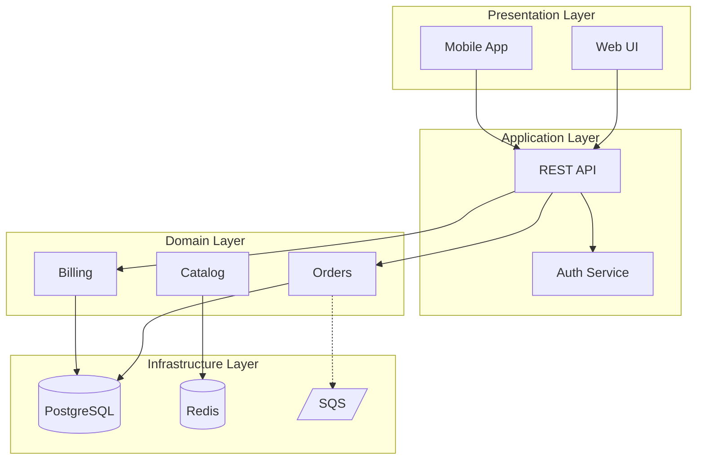
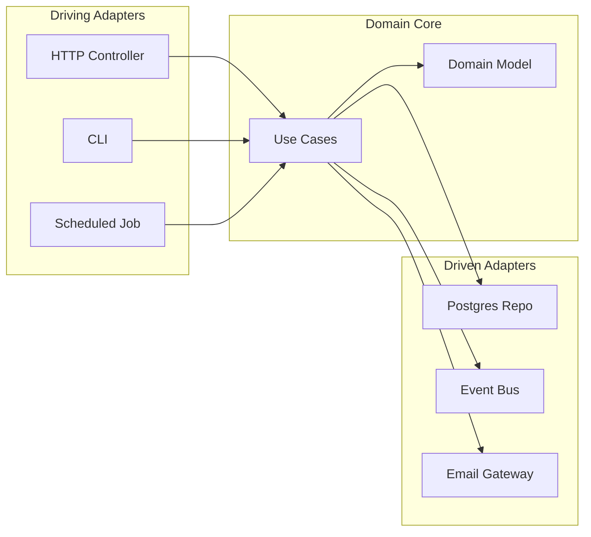
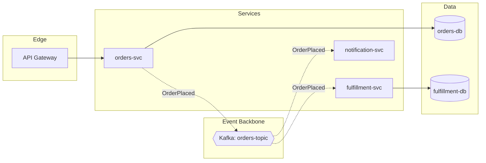

# Architecture Diagrams Reference (Canvas `architecture` recipe)

Purpose: Produce informal, ad-hoc system architecture sketches using Mermaid `flowchart` + `subgraph` — fast enough for a Slack DM, readable enough for an ADR. These are not C4 models; they are the diagrams engineers draw on whiteboards to align on shape before committing to formal modeling.

## Scope Boundary

- **Canvas `architecture`**: Informal architecture sketches. One view per diagram: logical, physical, or deployment. Topologies include layered monolith, hexagonal / ports-and-adapters, microservice mesh, event-driven bus, BFF + edge.
- **Canvas `c4`**: Formal C4 rendering with Mermaid C4 syntax (System Context / Container / Component). Use when the conversation already speaks in C4 vocabulary.
- **Stratum (elsewhere)**: Canonical C4 modeling via Structurizr DSL, ATAM/CBAM evaluation, fitness functions.

If the ask is "sketch how the pieces fit" → `architecture`. If the ask is "give me a C4 Container view" → `c4`. If the ask is "model and evaluate our architecture" → `Stratum`.

## View Selection

| View | Answers | Subgraph grouping |
|------|---------|-------------------|
| Logical | What are the modules and how do they call each other? | Layers or bounded contexts |
| Physical | What runs where (processes, nodes, clusters)? | Hosts, pods, VMs |
| Deployment | What lives in which environment (region, VPC, zone)? | Regions, VPCs, availability zones |

Pick one per diagram. Combining logical + deployment in the same sketch is the most common readability failure.

## Workflow

```
UNDERSTAND  →  pick view (logical / physical / deployment)
            →  pick topology vocabulary (layered / hexagonal / microservice / event-driven)
            →  list the ≤7 top-level groupings before any node

ANALYZE     →  for each grouping, list concrete, named elements (real service names)
            →  list edges: sync call, async event, shared DB, read replica
            →  mark external boundaries (third-party APIs, SaaS)

DRAW        →  Mermaid flowchart LR (most architecture reads left-to-right)
            →  wrap each grouping in a `subgraph` with a human-readable label
            →  distinguish edge kinds: solid for sync, dotted for async, thick for primary path

REVIEW      →  ≤20 nodes; split by subgraph if over
            →  every subgraph has a purpose label, not just a name
            →  external boundary is visually distinct (dashed border or separate subgraph)
            →  ensure arrow direction matches call direction (not data direction)
```

## Mermaid Patterns

### Layered Monolith (Logical View)



### Hexagonal / Ports-and-Adapters



### Event-Driven Microservices (Physical View)



## Anti-Patterns

- Mixing logical and physical nodes (a domain "Orders" module next to a "us-east-1a" zone) — split into two diagrams and cross-link.
- Subgraphs with generic labels ("Group A", "Backend") — label by purpose ("Domain Layer", "Event Backbone").
- Undifferentiated edges — if both sync and async calls exist, distinguish with solid vs dotted.
- Drawing every microservice individually when 12+ exist — group by bounded context subgraph and drill down in a follow-up diagram.
- Re-drawing a C4 Container view in flowchart syntax — if C4 vocabulary is already in use, switch to the `c4` recipe.
- Smuggling deployment detail (regions, VPCs) into a logical view — separate views.

## Handoff

- To `Stratum` when: the sketch stabilizes and the team wants a canonical model with evaluation (ATAM/CBAM) and fitness functions.
- To `c4` (within Canvas): when the audience explicitly wants a C4 level rendering.
- To `Atlas`: when the diagram exposes dependency cycles, god modules, or a debt assessment request emerges.

## Output Checklist

- [ ] Single view declared (logical / physical / deployment).
- [ ] Topology pattern declared (layered / hexagonal / microservice / event-driven / BFF).
- [ ] Subgraphs have purpose labels.
- [ ] Sync vs async edges visually distinct.
- [ ] External boundaries marked.
- [ ] ≤20 nodes, split and cross-link otherwise.
- [ ] Note in `Sources`: "informal sketch; canonical model not authored here."
