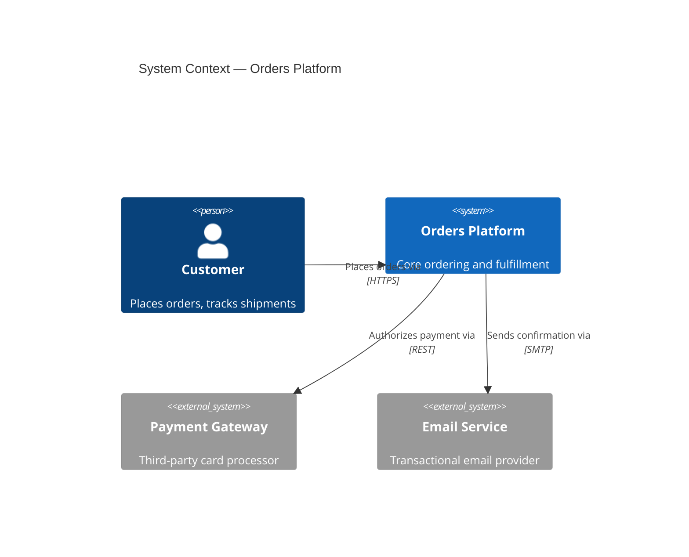
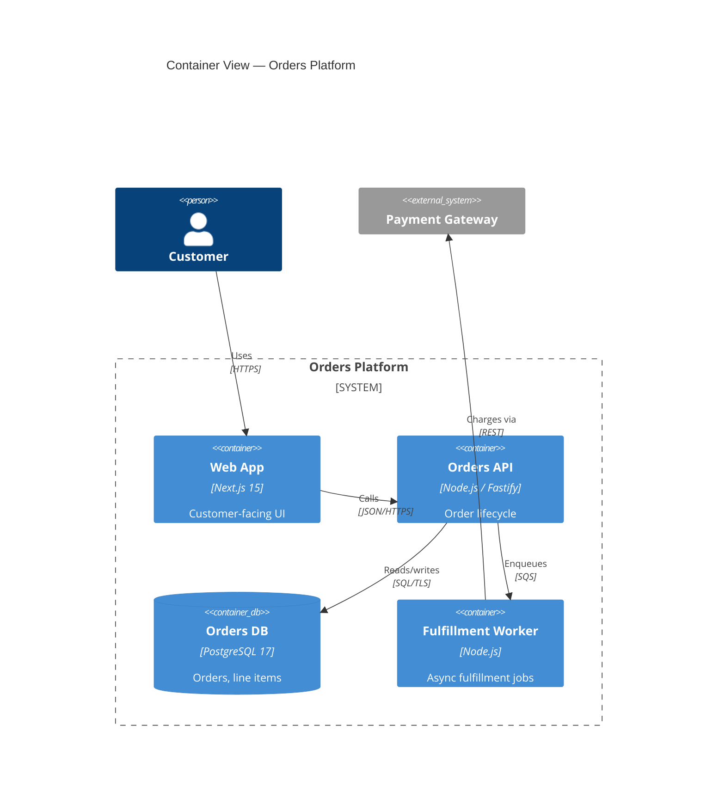
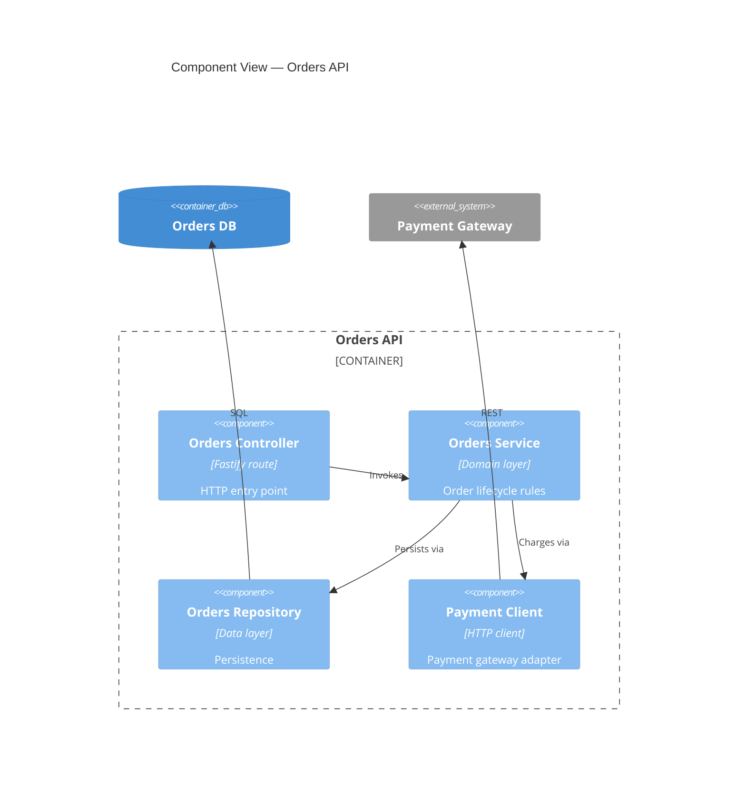

# C4 Diagrams Reference (Canvas `c4` recipe)

Purpose: Render C4 model views — System Context, Container, Component, and Code — as Mermaid C4 diagrams (`C4Context` / `C4Container` / `C4Component`) that are readable in-PR and embeddable in Markdown docs. Canvas renders the visual; it does not own the canonical model.

## Scope Boundary

- **Canvas `c4`**: Mermaid C4 rendering only. Input is either a natural-language description of the system, an existing Stratum Structurizr DSL, or reverse-generated structure from code.
- **Stratum (elsewhere)**: Canonical C4 modeling — Structurizr DSL authoring, architectural evaluation (ATAM/CBAM), fitness functions, and DSL-as-source-of-truth governance.

If the ask is "model this architecture in C4 and evaluate it" → hand off to `Stratum`. If the ask is "render a Mermaid C4 diagram I can paste into a PR description or ADR" → stay in Canvas `c4`.

For Code-level (L4) views, Mermaid C4 syntax does not apply — fall back to the Canvas `class` recipe.

## Input Sources

| Source | Use when | Fidelity |
|--------|----------|----------|
| Structurizr DSL (from Stratum) | Canonical model already exists | High — derive names, relationships, tags verbatim |
| Natural-language description | Ad-hoc request, no formal model yet | Medium — flag that Stratum owns the canonical version |
| Reverse-generated from code | Single-container scope (components from package structure) | Medium — verify against actual imports, not inferred ones |
| Existing diagram + refactor request | Re-layout, split, or level-transition | High — preserve existing element names |

## Workflow

```
UNDERSTAND  →  identify target level (Context / Container / Component)
            →  one level per diagram; never mix
            →  locate canonical source: Stratum DSL, code, or verbal

ANALYZE     →  extract Person / System / Container / Component nodes
            →  extract directional relationships with concrete labels
            →  decide boundary: System_Boundary vs Enterprise_Boundary

DRAW        →  pick C4Context / C4Container / C4Component
            →  use Person() / System() / System_Ext() / Container() / Component()
            →  label every Rel() with verb + protocol (e.g. "reads via HTTPS")

REVIEW      →  ≤20 elements per diagram (split by boundary if over)
            →  every Rel has a verb, not just an arrow
            →  external systems use *_Ext variants
            →  flag: "canonical model lives in Stratum DSL at <path>"
```

## Mermaid C4 Syntax Patterns

### Context (L1)



### Container (L2)



### Component (L3)



## Anti-Patterns

- Mixing levels in one diagram (Person + Component side-by-side) — each view answers one question only.
- Using generic `System` for third-party services — always `System_Ext`.
- Unlabeled `Rel()` arrows — a directional arrow without verb + protocol is noise.
- Re-authoring a Structurizr DSL's node names in Canvas — if Stratum owns the model, derive names verbatim to prevent drift.
- Stuffing 40+ components into one Component view — split by subsystem or bounded context, one diagram per split.
- Using C4 syntax for Code-level (class/package internals) — fall back to Mermaid `classDiagram` via the Canvas `class` recipe.

## Handoff to Stratum

When the user asks for evaluation, fitness functions, or "the source of truth for our architecture," stop rendering and hand off:

- Signal Stratum: "Canvas rendered a Mermaid C4 view at <level>. Canonical DSL should live in Stratum."
- Artifacts to return: the Mermaid block, the element inventory (names + descriptions), and the level rendered.
- Open question for Stratum: "Should the DSL include deployment view or stay logical-only?"

## Output Checklist

- [ ] One C4 level per diagram.
- [ ] Every `Rel()` has a verb and (where meaningful) a protocol/technology.
- [ ] External systems use `System_Ext` / `Container_Ext`.
- [ ] Title states system name and level ("Container View — Orders Platform").
- [ ] If a Stratum DSL exists, note its path in the `Sources` section.
- [ ] ≤20 primary elements; split and cross-link if over.
