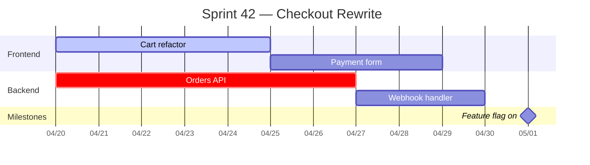
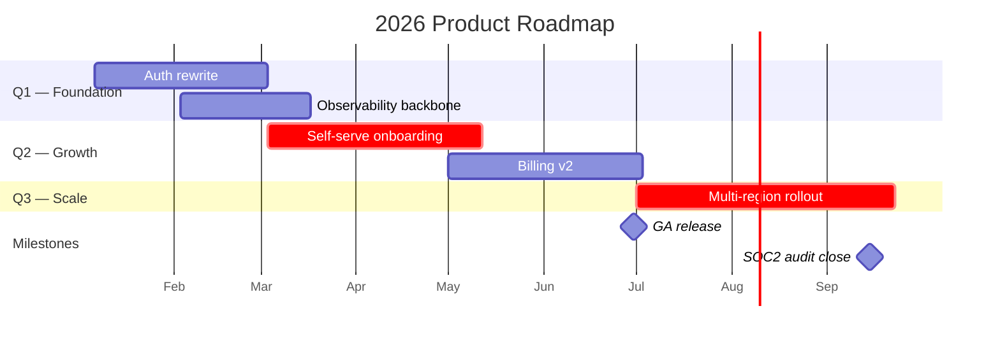
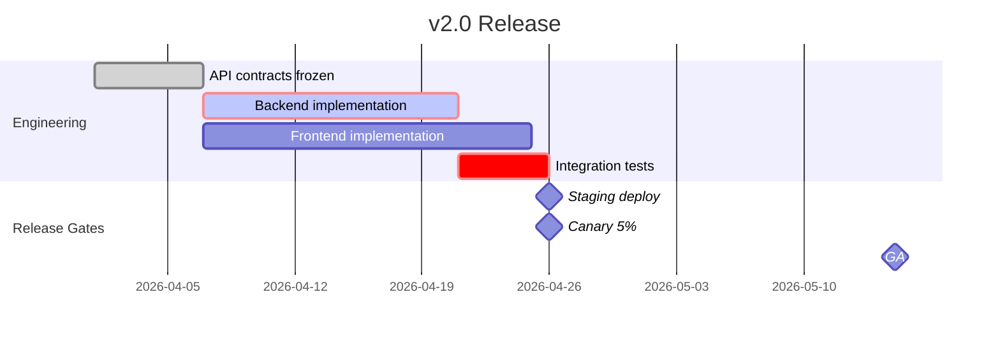

# Gantt / Roadmap / Timeline Reference (Canvas `gantt` recipe)

Purpose: Render timeline visuals — gantt charts, release roadmaps, quarterly views — using Mermaid `gantt` syntax. Canvas draws the picture; the release plan itself lives elsewhere.

## Scope Boundary

- **Canvas `gantt`**: Visual rendering of a schedule or roadmap. Inputs are dates, task list, dependencies, milestones.
- **Launch (elsewhere)**: Owns the release plan, versioning strategy, CHANGELOG, feature flags, rollback plans. Launch decides what ships and when; Canvas shows it.
- **Sherpa (elsewhere)**: Owns task decomposition into ≤15-min atomic steps; Canvas does not re-plan.

If the ask is "plan the Q3 release and write the CHANGELOG" → `Launch`. If the ask is "show me Launch's plan as a gantt for the stakeholder deck" → stay in Canvas `gantt`.

## Input Sources

| Source | Use when | Notes |
|--------|----------|-------|
| Launch release plan | Launch has already authored dates, milestones, release gates | Derive verbatim; do not re-estimate |
| Sherpa task breakdown | Project plan exists as atomic steps | Aggregate steps into gantt-friendly task blocks (avoid >40 tasks) |
| Verbal roadmap | Leadership sketched Q1–Q4 themes | Render as quarterly sections; flag that Launch should formalize |
| Project tracker export (Linear / Jira / GitHub) | Issues have start/due dates | Map one epic → one section; one issue → one task |

## Workflow

```
UNDERSTAND  →  pick timeline scope: sprint / release / quarter / year
            →  confirm date format (YYYY-MM-DD) and axis unit (day / week / month)
            →  locate authoritative plan: Launch, Sherpa, tracker

ANALYZE     →  extract tasks with start + duration (or start + end)
            →  extract dependencies (task B starts after task A)
            →  extract milestones (point-in-time markers)
            →  mark critical-path tasks

DRAW        →  Mermaid gantt block
            →  group tasks into `section` blocks by team / theme / quarter
            →  use `after <taskId>` for dependencies
            →  use `milestone` markers for release points
            →  use `crit` for critical-path tasks

REVIEW      →  ≤20 tasks per diagram (split by section if over)
            →  axis unit matches timeline scope (weeks for releases, months for quarters)
            →  milestones distinct from tasks
            →  critical path visually obvious
            →  dates verified against source plan
```

## Mermaid Gantt Patterns

### Sprint View (2-week scope)



### Quarterly Roadmap



### Release Timeline with Dependencies + Critical Path



## Syntax Notes

- `dateFormat YYYY-MM-DD` is the safe default; ISO keeps dates unambiguous across renderers.
- `axisFormat`: `%m/%d` for sprint, `%b` for quarterly, `%Y-%m` for yearly.
- Task states: `done` (past), `active` (in progress), `crit` (critical path) — combinable: `crit, active, id, ...`.
- `milestone` tasks take `0d` duration and render as a diamond marker.
- Dependencies: `after <taskId>` — chain with commas: `after a, b` waits for both.
- IDs must be unique per diagram and referenced in `after` clauses.

## Anti-Patterns

- Rendering a 60-task gantt in one diagram — split by section, per team, or per quarter.
- Using gantt for pure dependency graphs (no time axis) — use a flowchart instead.
- Hand-drawn dates that drift from Launch's actual release plan — always cite the source plan and date of sync.
- Missing critical path — if a release exists, at least one chain must be `crit`.
- Milestones with non-zero duration — milestones are point-in-time; use `0d`.
- Quarterly roadmaps with daily `axisFormat` — mismatched granularity makes the axis unreadable.
- Re-authoring the CHANGELOG inside the diagram explanation — CHANGELOG is Launch's artifact; link to it.

## Handoff

- From `Launch`: receive release plan (dates, milestones, gates, rollback windows). Render. Return the Mermaid block with an explicit "rendered from Launch plan as of YYYY-MM-DD" note.
- To `Launch`: if rendering reveals date conflicts, missing dependencies, or uncovered critical path, flag and hand back — Canvas does not silently fix plan issues.
- To `Stage`: if the gantt is destined for a stakeholder deck, hand off the rendered Mermaid for slide embedding.
- To `Sherpa`: if tasks lack decomposition to ≤15-min atomic steps, flag for decomposition before re-rendering.

## Output Checklist

- [ ] Timeline scope stated (sprint / release / quarter / year).
- [ ] `dateFormat` and `axisFormat` match scope.
- [ ] At least one `section` grouping.
- [ ] Dependencies use `after <id>`, not hand-synced dates.
- [ ] Milestones marked with `milestone` and `0d`.
- [ ] Critical path tasks marked `crit`.
- [ ] ≤20 tasks; split otherwise.
- [ ] `Sources` cites Launch plan, tracker export, or "informal sketch — Launch has not formalized."
