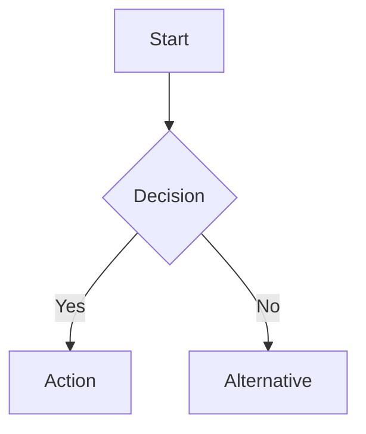
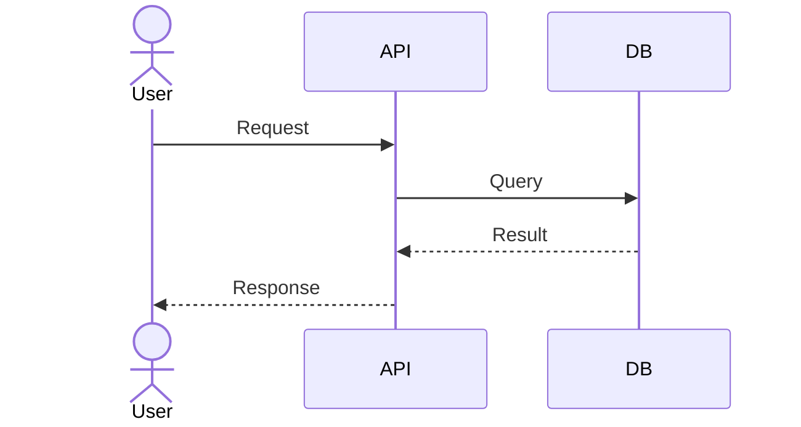
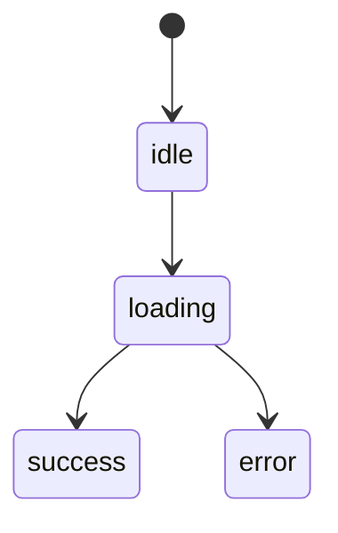
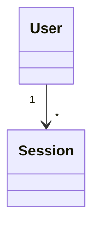
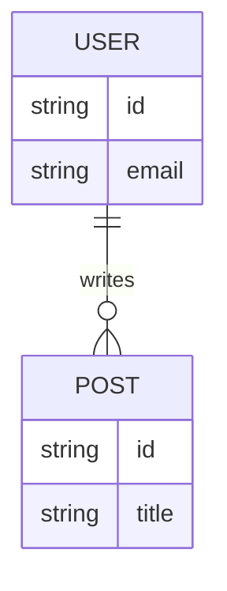
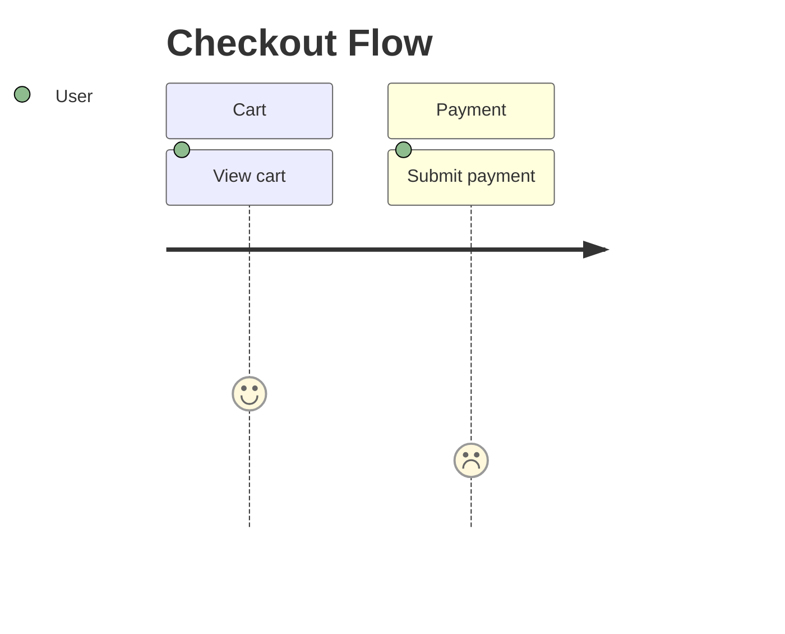
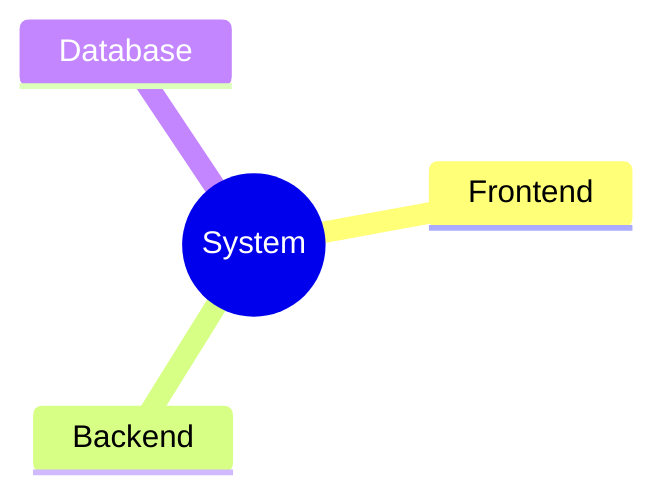
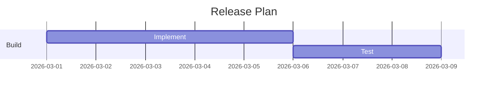
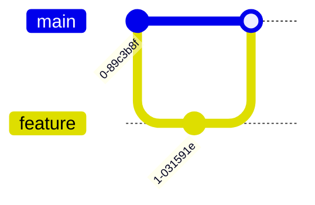
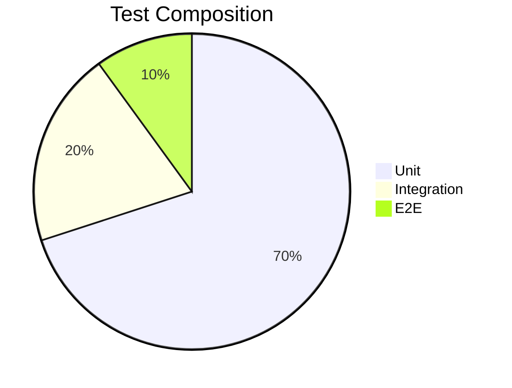

# Diagram Templates Reference

Purpose: Read this when you need a fast, syntax-safe starter for a common diagram family.

## Contents

- Selection matrix
- Mermaid starters
- draw.io note

## Selection Matrix

| Diagram | Use For |
|---------|---------|
| Flowchart | Control flow, business process, API routes |
| Sequence | Interactions over time |
| State | Lifecycle or state transitions |
| Class | Types and dependencies |
| ER | Database structure |
| Journey | User or DX experience |
| Mind Map | Concepts or hierarchy |
| Gantt | Schedule and dependencies |
| Git Graph | Branch or merge history |
| Pie Chart | Ratios or composition |

## Flowchart

## Sequence

## State

## Class

## ER

## Journey

## Mind Map

## Gantt

## Git Graph

## Pie Chart

## draw.io Note

Use `references/drawio-specs.md` when XML structure, IDs, edge routing, or layout control matters.
