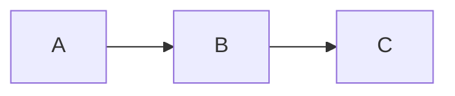

# Diagram-as-Code Tools Comparison

> Mermaid vs D2 vs PlantUML vs Structurizr vs Graphviz 比較、選定ガイド、AI統合トレンド

## 1. 総合比較

| 特性 | Mermaid | D2 | PlantUML | Structurizr | Graphviz |
|------|---------|-----|----------|-------------|----------|
| 言語 | JavaScript | Go | Java | Java/DSL | C |
| リリース | 2014 | 2022 | 2009 | 2016 | 1991 |
| ライセンス | MIT | MPL 2.0 | GPL 3.0 | 商用+OSS | CPL 1.0 |
| GitHub ネイティブ | **Yes** | **Yes** | No | No | No |
| ダークモード | Yes | **Yes** | No | — | No |
| Autoformat | No | **Yes** | No | — | No |
| アニメーション | 限定的 | **Yes** | No | No | No |
| C4 モデル | Yes | 限定的 | Yes (C4-PlantUML) | **専門** | No |
| シーケンス図 | Yes | Yes | **最強** | Yes | No |
| コードスニペット | No | **Yes** | No | No | No |

---

## 2. 各ツールの強みと推奨ユースケース

### Mermaid

**強み**: GitHub/GitLab/Notion ネイティブレンダリング、学習コスト最小、Markdown 内直接記述
**弱み**: レイアウト細かい制御が困難、複雑な図でレンダリング品質低下
**推奨**: ドキュメント統合、README、チーム全体での採用

### D2

```d2
server: Web Server {
  handler: Request Handler
  db: Database Connection
}
client -> server.handler: HTTPS
```

**強み**: 最も美しいレンダリング、ELK エンジン、アニメーション、Autoformat、SVG/PNG/PDF/PowerPoint 出力
**弱み**: 新しくエコシステムが発展途上
**推奨**: プレゼンテーション品質のアーキテクチャ図、技術ブログ

### PlantUML

**強み**: 最も包括的な UML サポート、レイアウト詳細制御、巨大コミュニティ
**弱み**: Java 依存、GPL 3.0、ダークモード非対応
**推奨**: 正式な UML 図、エンタープライズドキュメント、詳細なシーケンス図

### Structurizr DSL

```structurizr
workspace {
    model {
        user = person "User"
        system = softwareSystem "My System" {
            webapp = container "Web Application"
            db = container "Database"
        }
        user -> webapp "Uses"
        webapp -> db "Reads/Writes"
    }
}
```

**強み**: C4 モデル特化、モデルとビューの分離、ADR 可視化統合
**弱み**: C4 以外には不向き
**推奨**: C4 モデル正式採用、大規模アーキテクチャドキュメント

---

## 3. 選定ガイド

| シナリオ | 推奨ツール |
|---------|-----------|
| GitHub README に図を埋め込みたい | **Mermaid** |
| 高品質なアーキテクチャ図が必要 | **D2** |
| 正式な UML 図が要求される | **PlantUML** |
| C4 モデルを正式採用 | **Structurizr** |
| GUI で素早く図を作りたい | **draw.io** |
| コード内コメントに図を入れたい | **ASCII art** |
| ADR を可視化したい | **Structurizr Lite** |
| 複数ツールの統一レンダリング | **Kroki** (統合プロキシ) |

---

## 4. draw.io 2025 トレンド

- **MCP (Model Context Protocol) 統合**: AI がプログラム的に図を生成・修正
- **Mermaid/CSV 入力からの図生成**: 構造化テキストから自動生成
- **Smart Templates**: テキスト説明から図を自動生成
- **レイヤー活用**: 関心事の分離、対象者別表示切替
- **.drawio ファイルの Git 管理**: XML 形式のため diff が取れる

---

## 5. AI 統合 (2025 トレンド)

LLM は Diagram-as-Code との相性が非常に良い:

- 自然言語プロンプトから図のシンタックスを生成
- コード変更に基づく図の自動更新
- フォーマット間の変換 (Mermaid ↔ D2 ↔ PlantUML)
- 図のエラーはレンダリング時に発見 → AI 生成のリスクが低い

**生成速度**: 手動の 4-5 倍、初期ドラフト作成に特に有効。

---

## 6. 統合パターン

### GitHub/GitLab ネイティブ

````markdown

````

### mermaid-cli

```bash
mmdc -i diagram.mmd -o diagram.svg
mmdc -i README.md -o README-rendered.md  # Markdown 内を画像に変換
```

### 対応プラットフォーム

| プラットフォーム | サポート |
|----------------|---------|
| GitHub/GitLab | ネイティブ |
| Notion | コードブロック |
| Obsidian | ネイティブ |
| VS Code | 拡張機能 |
| MkDocs Material | プラグイン |
| Docusaurus | プラグイン |

---

## 7. 設計原則 (ツール共通)

1. **適切な図の種類を選択**: フローチャートをデフォルトにしない
2. **単一抽象度レベル**: 1図に異なる粒度を混在させない
3. **線の交差回避**: 多い場合は分割すべきサイン
4. **色は控えめに意味を持って**: 白黒でも読める図を基本 (男性12人に1人は色覚異常)
5. **線の太さでフロー区別**: 主要=太、副次=細、オプション=点線
6. **A4 印刷テスト**: 1枚に印刷して読めるか
7. **すべてのコンポーネントにラベル**

**Source:** [Diagram as Code Tools 2025 (Vinr Academy)](https://vinr.academy/blog/diagram-as-code-tools-in-2025-a-comprehensive-comparison) · [text-to-diagram.com](https://text-to-diagram.com/) · [Diagrams Supercharged by AI (Simmering)](https://simmering.dev/blog/diagrams/) · [draw.io MCP](https://thomasthornton.cloud/draw-io-mcp-for-diagram-generation-why-its-worth-using/)
