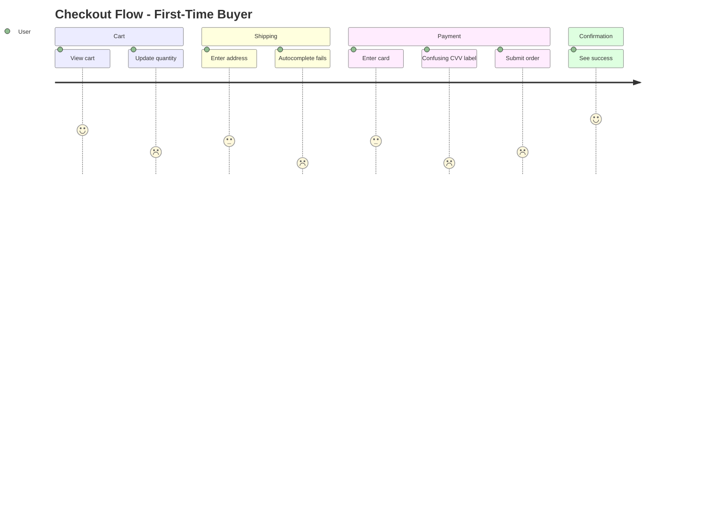
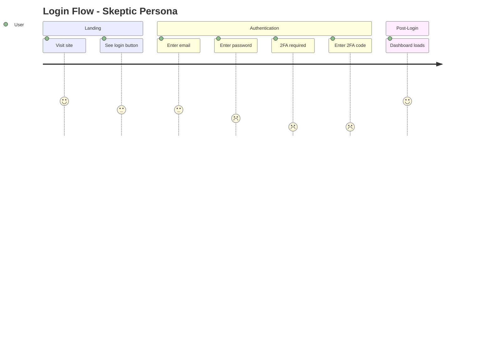
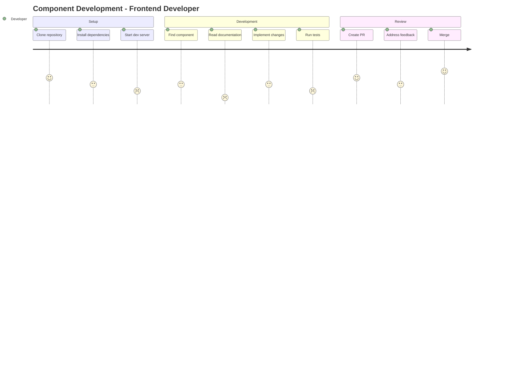
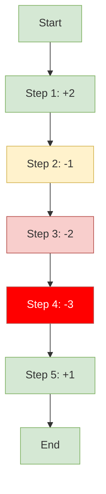
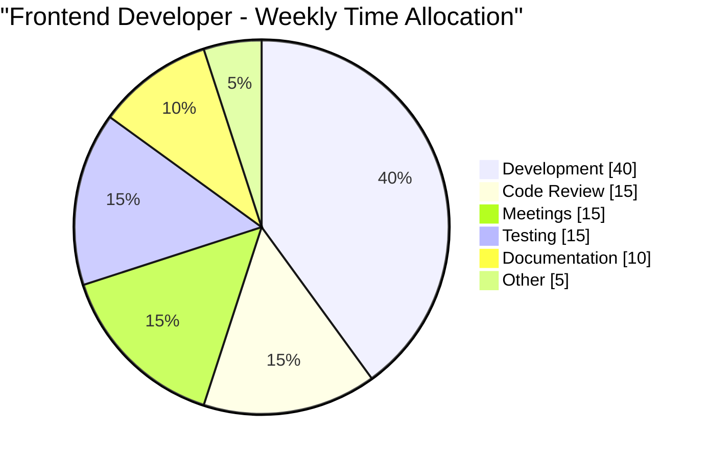
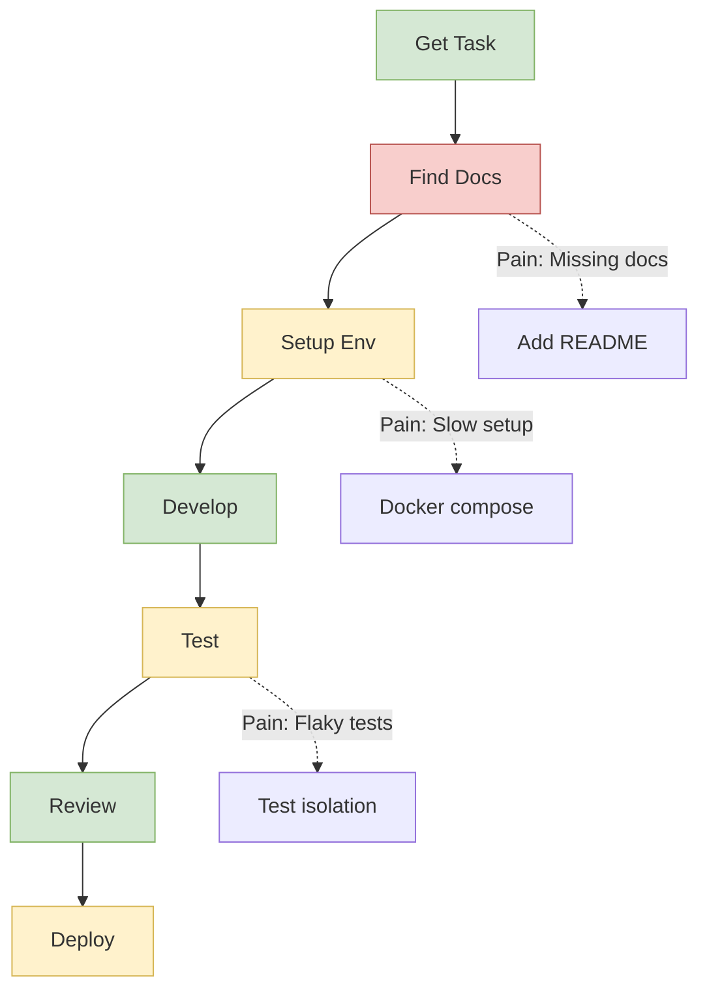
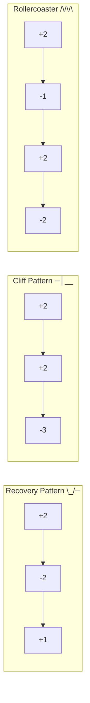
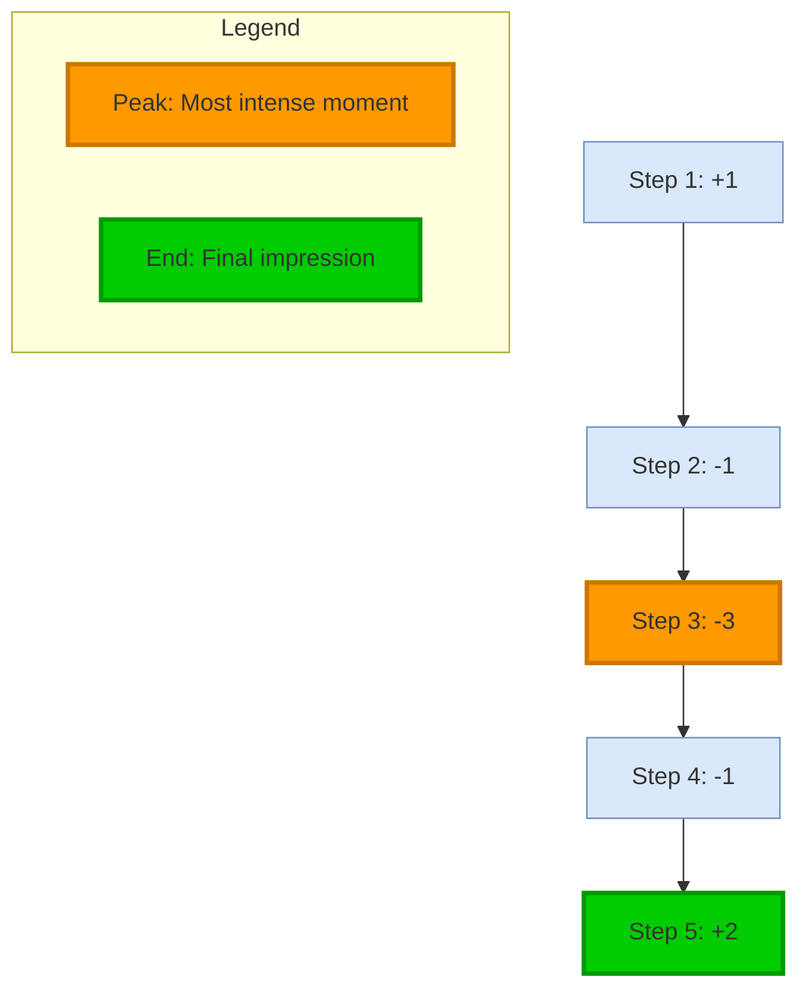

# Canvas Echo Integration Reference

Echo agent integration details. Journey Map, Emotion Score visualization, Cross-Persona comparison, and Internal Persona visualization.

---

## Overview

```
┌─────────────────────────────────────────────────────────────┐
│                      ECHO                                    │
│  Persona walkthrough → Emotion scores → Journey data        │
│  Internal Persona → Workflow context → Team structure       │
└─────────────────────┬───────────────────────────────────────┘
                      ↓
┌─────────────────────────────────────────────────────────────┐
│                     CANVAS                                   │
│  Journey Map / Friction Heatmap / Cross-Persona Matrix      │
│  Persona Profile / Team Structure / Workflow Diagram        │
└─────────────────────────────────────────────────────────────┘
```

### Visualization Types

| Echo Data Type | Canvas Output | Use Case |
|----------------|---------------|----------|
| User Journey | Journey Map | End user experience visualization |
| Emotion Scores | Friction Heatmap | Pain point identification |
| Cross-Persona | Comparison Matrix | Segment issue detection |
| Internal Persona | Profile Card | Team member visualization |
| Workflow Context | Workflow Diagram | Process flow mapping |
| Team Structure | Organization Chart | Team collaboration view |

---

## Handoff Format (Echo → Canvas)

### Standard Journey Data

```markdown
## Echo → Canvas Journey Visualization

**Flow**: [Flow name]
**Persona**: [Persona name]
**Average Score**: [Average score]

**Journey Data**:
| Step | Action | Score | Friction Type |
|------|--------|-------|---------------|
| 1 | Land on page | +2 | None |
| 2 | Find signup | -1 | Mental Model Gap |
| 3 | Fill form | -2 | Cognitive Overload |
| 4 | Submit | -3 | Error Handling |
| 5 | Confirmation | +1 | Recovery |

...
```

### Cross-Persona Data

```markdown
## Echo → Canvas Cross-Persona Visualization

**Flow**: [Flow name]
**Personas**: [Persona list]

**Comparison Matrix**:
| Step | Newbie | Power | Mobile | Senior | Issue Type |
|------|--------|-------|--------|--------|------------|
| 1 | +1 | +2 | +1 | +1 | Non-Issue |
| 2 | -2 | +1 | -2 | -3 | Segment |
| 3 | -3 | -2 | -3 | -3 | Universal |

**Analysis**:
- Universal Issues: Step 3
- Segment Issues: Step 2 (affects Newbie, Mobile, Senior)
...
```

### Internal Persona Data

```markdown
## Echo → Canvas Internal Persona Visualization

**Persona Type**: Internal
**Category**: [developer | designer | business | operations]
**Role**: [Job type]

**Profile Summary**:
| Attribute | Value |
|-----------|-------|
| Job Type | Frontend Developer |
| Team | Platform Team |
| Experience | 3-5 years |
| Primary Tools | VS Code, Chrome DevTools |

**Workflow Context**:
...
```

### Team Structure Data

```markdown
## Echo → Canvas Team Structure Visualization

**Organization**: [Organization name]
**Scope**: [Team/Department/Division]

**Team Composition**:
| Role | Count | Primary Responsibility |
|------|-------|----------------------|
| Frontend Developer | 3 | UI implementation |
| Backend Developer | 2 | API development |
| QA Engineer | 1 | Quality assurance |
| Product Manager | 1 | Requirements |

**Collaboration Matrix**:
| From → To | Frequency | Content |
...
```

---

## Journey Map Templates

### Mermaid Journey with Emotion Curve



### Enhanced Journey with Friction Markers



### DX (Developer Experience) Journey



---

## Friction Heatmap

Visualize friction points within a flow using color coding.

### Mermaid Flowchart with Color Coding



### Color Scale

| Score | Color | CSS Class | Hex |
|-------|-------|-----------|-----|
| +3, +2 | Green | `positive` | #d5e8d4 |
| +1, 0 | Yellow | `neutral` | #fff2cc |
| -1 | Orange | `warning` | #ffe6cc |
| -2 | Red | `negative` | #f8cecc |
| -3 | Dark Red | `critical` | #ff0000 |

---

## Cross-Persona Comparison Visualization

### Grouped Bar Chart (ASCII)

```
Checkout Flow - Cross-Persona Emotion Scores

Step 1 (View Cart)
  Newbie   ████████░░ +2
  Power    ██████████ +3
  Mobile   ████████░░ +2
  Senior   ██████░░░░ +1

Step 2 (Enter Address)
  Newbie   ████░░░░░░ -1
  Power    ████████░░ +2
  Mobile   ██░░░░░░░░ -2
  Senior   ░░░░░░░░░░ -3  ← Segment Issue

Step 3 (Payment)
...
```

### Mermaid XY Chart

```mermaid
xychart-beta
    title "Cross-Persona Emotion Scores"
    x-axis [Step1, Step2, Step3, Step4, Step5]
    y-axis "Score" -3 --> 3
    line [2, -1, -3, -2, 1] "Newbie"
    line [3, 2, -2, -1, 2] "Power"
    line [2, -2, -3, -2, 1] "Mobile"
```

---

## Internal Persona Visualization

### Persona Profile Card

```mermaid
flowchart TB
    subgraph Profile["Frontend Developer - Platform Team"]
        direction TB
        subgraph Info["Profile"]
            I1["Experience: 3-5 years"]
            I2["Tools: VS Code, Chrome DevTools"]
            I3["OS: macOS"]
        end
        subgraph Goals["Goals"]
            G1["Build reusable components"]
            G2["Improve DX"]
            G3["Reduce tech debt"]
        end
        subgraph Pain["Pain Points"]
            P1["Inconsistent APIs"]
// ...
```

### Internal Persona Profile (ASCII)

```
┌────────────────────────────────────────────────────────────┐
│  FRONTEND DEVELOPER                                         │
│  Platform Team                                              │
├────────────────────────────────────────────────────────────┤
│  Experience: 3-5 years                                      │
│  Tools: VS Code, Chrome DevTools, Figma                     │
│  OS: macOS                                                  │
│  Work Style: Hybrid                                         │
├────────────────────────────────────────────────────────────┤
│  GOALS                          │  PAIN POINTS             │
│  ─────                          │  ───────────             │
│  • Build reusable components    │  • Inconsistent APIs     │
│  • Improve developer experience │  • Missing documentation │
│  • Reduce technical debt        │  • Slow build times      │
├────────────────────────────────────────────────────────────┤
...
```

---

## Team Structure Visualization

### Organization Chart (Mermaid)

```mermaid
flowchart TB
    subgraph Platform["Platform Team"]
        PM[Product Manager]
        subgraph Engineering["Engineering"]
            FE1[Frontend Dev]
            FE2[Frontend Dev]
            BE1[Backend Dev]
            BE2[Backend Dev]
            QA[QA Engineer]
        end
        subgraph Design["Design"]
            UI[UI Designer]
        end
    end

// ...
```

### Team Collaboration Matrix

```mermaid
flowchart LR
    subgraph Team["Team Collaboration"]
        FE[Frontend]
        BE[Backend]
        QA[QA]
        PM[PdM]
        DS[Design]
    end

    FE <-->|Daily: API contracts| BE
    FE <-->|Weekly: Test cases| QA
    PM -->|Weekly: Requirements| FE
    PM -->|Weekly: Requirements| BE
    DS -->|Bi-weekly: Designs| FE

// ...
```

### Team Structure (ASCII)

```
Platform Team
├── Product Manager (1)
│   └── Sprint planning, requirements, stakeholder management
│
├── Engineering (5)
│   ├── Frontend (2)
│   │   └── UI implementation, component library
│   ├── Backend (2)
│   │   └── API development, data layer
│   └── QA (1)
│       └── Test automation, quality gates
│
└── Design (1)
    └── UI/UX design, design system

...
```

---

## Workflow Context Visualization

### Daily Workflow Diagram

```mermaid
flowchart LR
    subgraph Morning["Morning"]
        M1[Standup]
        M2[Code Review]
    end

    subgraph Core["Core Work"]
        C1[Development]
        C2[Testing]
        C3[Documentation]
    end

    subgraph EOD["End of Day"]
        E1[PR Creation]
        E2[Status Update]
// ...
```

### Task Distribution



### Workflow Pain Points Heatmap



---

## Emotion Trend Patterns

### Pattern Recognition Visualization



---

## Peak-End Visualization

Highlight memorable points in user experience.



---

## Saved Persona Journey Integration

Link Echo's saved personas with Canvas saved diagrams.

### Workflow

```
1. Echo loads persona from .agents/personas/{service}/
2. Echo performs walkthrough, generates journey data
3. Canvas receives journey data
4. Canvas checks for existing journey in .agents/diagrams/{project}/
5. Canvas updates or creates journey diagram
6. Canvas saves to library with persona reference
```

### File Linking (User Persona)

```markdown
---
name: checkout-journey-first-time-buyer
type: journey
format: mermaid
persona: .agents/personas/ec-platform/first-time-buyer.md
persona_type: user
flow: checkout
created: 2026-01-31
---
```

### File Linking (Internal Persona)

```markdown
---
name: dx-journey-frontend-developer
type: journey
format: mermaid
persona: .agents/personas/ec-platform/internal/frontend-developer.md
persona_type: internal
category: developer
flow: component-development
created: 2026-01-31
---
```

---

## Question Templates

### ON_JOURNEY_VISUALIZATION

```yaml
questions:
  - question: "What format should be used to visualize the Journey data?"
    header: "Format"
    options:
      - label: "Mermaid Journey (Recommended)"
        description: "Standard journey map visualization"
      - label: "Friction Heatmap"
        description: "Visualize friction points with colors"
      - label: "Emotion Trend Chart"
        description: "Emotion score trend graph"
      - label: "ASCII Journey"
        description: "Text-based journey visualization"
    multiSelect: false
```

### ON_CROSS_PERSONA_FORMAT

```yaml
questions:
  - question: "What format should be used to visualize Cross-Persona comparison?"
    header: "Format"
    options:
      - label: "Comparison Matrix (Recommended)"
        description: "Persona × Step matrix"
      - label: "Overlay Chart"
        description: "Overlaid multi-persona graph"
      - label: "Issue Highlight"
        description: "Highlight Universal/Segment Issues"
    multiSelect: false
```

### ON_JOURNEY_SAVE

```yaml
questions:
  - question: "Would you like to save the generated Journey to the library?"
    header: "Save"
    options:
      - label: "Yes, save with persona link (Recommended)"
        description: "Save with reference to persona file"
      - label: "Save without link"
        description: "Save without reference"
      - label: "Don't save"
        description: "Do not save this time"
    multiSelect: false
```

### ON_INTERNAL_PERSONA_VISUALIZATION

```yaml
questions:
  - question: "What format should be used to visualize the Internal Persona?"
    header: "Format"
    options:
      - label: "Profile Card (Recommended)"
        description: "Persona profile as visual card"
      - label: "Workflow Diagram"
        description: "Visualize daily workflow and tasks"
      - label: "Pain Points Heatmap"
        description: "Highlight friction in work processes"
      - label: "ASCII Profile"
        description: "Text-based profile visualization"
    multiSelect: false
```

### ON_TEAM_STRUCTURE_FORMAT

```yaml
questions:
  - question: "What format should be used to visualize team structure?"
    header: "Format"
    options:
      - label: "Organization Chart (Recommended)"
        description: "Hierarchical team structure"
      - label: "Collaboration Matrix"
        description: "Team interaction patterns"
      - label: "Role Distribution"
        description: "Pie chart of roles"
      - label: "ASCII Structure"
        description: "Text-based team structure"
    multiSelect: false
```

### ON_DX_JOURNEY_VISUALIZATION

```yaml
questions:
  - question: "What type of DX (Developer Experience) journey should be visualized?"
    header: "DX Type"
    options:
      - label: "Development Workflow (Recommended)"
        description: "End-to-end development flow"
      - label: "Onboarding Journey"
        description: "New team member experience"
      - label: "Debug/Troubleshoot Flow"
        description: "Issue resolution process"
      - label: "Review/Deploy Flow"
        description: "Code review to deployment"
    multiSelect: false
```

---

## Output Examples

### Journey Map Report

```markdown
## Canvas Journey Map

### Checkout Flow - First-Time Buyer

**Purpose:** Visualize first-time buyer checkout experience
**Persona:** First-Time Buyer (.agents/personas/ec-platform/first-time-buyer.md)
**Format:** Mermaid Journey
**Average Score:** -0.5 (Needs improvement)

### Diagram

[Mermaid code]

### Key Findings

...
```

### Internal Persona Report

```markdown
## Canvas Internal Persona Profile

### Frontend Developer - Platform Team

**Persona Type:** Internal
**Category:** Developer
**Source:** .agents/personas/ec-platform/internal/frontend-developer.md

### Profile Card

[Mermaid/ASCII visualization]

### Key Insights

| Aspect | Finding | Severity |
...
```

### Team Structure Report

```markdown
## Canvas Team Structure

### Platform Team Overview

**Organization:** Product Development
**Team Size:** 8 members
**Focus:** E-commerce platform

### Organization Chart

[Mermaid diagram]

### Collaboration Analysis

| Interaction | Frequency | Quality Score |
...
```

---

## Visual Journey Map (Navigator → Echo → Canvas)

Visualize the results of Echo's review of Navigator screenshots.

### Overview

```
┌─────────────────────────────────────────────────────────────┐
│                      NAVIGATOR                               │
│  Screenshot capture → Device context → Flow documentation   │
└─────────────────────┬───────────────────────────────────────┘
                      ↓ NAVIGATOR_TO_ECHO_HANDOFF
┌─────────────────────────────────────────────────────────────┐
│                        ECHO                                  │
│  Visual Review: First Glance → Scan Pattern → Emotion Score │
└─────────────────────┬───────────────────────────────────────┘
                      ↓ ECHO_TO_CANVAS_VISUAL_HANDOFF
┌─────────────────────────────────────────────────────────────┐
│                       CANVAS                                 │
│  Visual Journey Map → Friction Heatmap → Comparison         │
└─────────────────────────────────────────────────────────────┘
```

### Handoff Format (Echo → Canvas)

```markdown
## ECHO_TO_CANVAS_VISUAL_HANDOFF

**Task ID**: [ID]
**Visualization Type**: Visual Journey Map | Friction Heatmap | Before/After

**Flow**: [Flow Name]
**Persona**: [Persona Name]
**Device**: [Device Context]

**Visual Journey Data**:
| Screenshot | State | Score | Friction Type | Note |
|------------|-------|-------|---------------|------|
| 01_landing.png | Initial | +1 | None | Hero clear |
| 02_form.png | Form | −2 | Touch Target | CTA too small |
| 03_error.png | Error | −3 | Readability | Error text unclear |
...
```

### Visual Journey Map Template

Journey Map with screenshot references:

```mermaid
journey
    title Signup Flow - Mobile User Visual Review
    section Landing
      View homepage: 4: User
      Find CTA: 3: User
    section Signup Form
      Open form: 3: User
      Fill email: 2: User
      Fill password: 2: User
      Submit: 1: User
    section Result
      See error: 1: User

    %% Screenshot References
    %% Step 1-2: 01_landing.png
// ...
```

### Visual Friction Heatmap

Overlay friction points on screenshots:

```
┌─────────────────────────────────────────────────────────────┐
│                    Screenshot: 02_form.png                   │
│  ┌─────────────────────────────────────────────────────┐   │
│  │                                                      │   │
│  │    [Logo]                               [Menu] ← 🟡  │   │
│  │                                                      │   │
│  │    ┌────────────────────────────────────────────┐   │   │
│  │    │              Signup Form                    │   │   │
│  │    │                                            │   │   │
│  │    │   Email: [________________] ← 🟢           │   │   │
│  │    │                                            │   │   │
│  │    │   Password: [____________] ← 🟡            │   │   │
│  │    │   (hint text too small)                    │   │   │
│  │    │                                            │   │   │
│  │    │         [Sign Up] ← 🔴                     │   │   │
...
```

### Visual Friction Heatmap (Mermaid)

```mermaid
flowchart TD
    classDef good fill:#d5e8d4,stroke:#82b366
    classDef warning fill:#fff2cc,stroke:#d6b656
    classDef bad fill:#f8cecc,stroke:#b85450
    classDef critical fill:#ff0000,stroke:#b85450,color:#fff

    subgraph Screenshot["02_form.png - Signup Form"]
        direction TB
        Header[Header/Logo]:::good
        Email[Email Input +1]:::good
        Password[Password Input -1]:::warning
        Hint[Password Hint -2]:::bad
        Submit[Submit Button -3]:::critical
    end

// ...
```

### Before/After Comparison

Before/after improvement comparison template:

```mermaid
flowchart LR
    subgraph Before["BEFORE"]
        direction TB
        B1[CTA: 32x32px]
        B2[Score: -2]
        B3[Touch target too small]
    end

    subgraph After["AFTER"]
        direction TB
        A1[CTA: 48x48px]
        A2[Score: +2]
        A3[Comfortable touch target]
    end

// ...
```

### Screenshot Reference Card

```mermaid
flowchart TB
    subgraph Card["Visual Review Card"]
        direction TB
        subgraph Meta["Metadata"]
            M1["Screenshot: 02_form.png"]
            M2["Persona: Mobile User"]
            M3["Device: iPhone 14 Pro"]
        end

        subgraph Scores["Visual Scores"]
            S1["Layout: +2"]
            S2["Typography: -1"]
            S3["CTA: -2"]
            S4["Trust: -1"]
        end
// ...
```

### Question Templates

#### ON_VISUAL_JOURNEY_FORMAT

```yaml
questions:
  - question: "What format should be used to visualize the Visual Journey?"
    header: "Format"
    options:
      - label: "Visual Journey Map (Recommended)"
        description: "Journey with screenshot references and emotion scores"
      - label: "Friction Heatmap"
        description: "Overlay friction points on screenshots"
      - label: "Before/After Comparison"
        description: "Side-by-side improvement comparison"
      - label: "All formats"
        description: "Generate complete visual documentation"
    multiSelect: false
```

#### ON_FRICTION_HIGHLIGHT

```yaml
questions:
  - question: "Which friction points should be highlighted in the visualization?"
    header: "Highlight"
    options:
      - label: "Critical only (-3)"
        description: "Focus on most severe issues"
      - label: "Critical and Moderate (-2, -3) (Recommended)"
        description: "Show significant friction points"
      - label: "All friction (-1, -2, -3)"
        description: "Comprehensive friction view"
    multiSelect: false
```

### Output Example

#### Visual Journey Map Report

```markdown
## Canvas Visual Journey Map

### Signup Flow - Mobile User Visual Review

**Task ID**: NAV-2026-0201-001
**Persona**: Mobile User (Commuter scenario)
**Device**: iPhone 14 Pro (390x844), Chrome Mobile, 4G
**Source**: Echo Visual Review

### Journey Diagram

\`\`\`mermaid
journey
    title Signup Flow - Mobile User
    section Landing
...
```

### File Linking

```markdown
---
name: signup-visual-journey-mobile
type: visual-journey
format: mermaid
persona: Mobile User
persona_type: user
flow: signup
device: iPhone 14 Pro
screenshots:
  - .navigator/screenshots/NAV-2026-0201-001/01_landing.png
  - .navigator/screenshots/NAV-2026-0201-001/02_form.png
  - .navigator/screenshots/NAV-2026-0201-001/03_error.png
created: 2026-02-01
---
```
