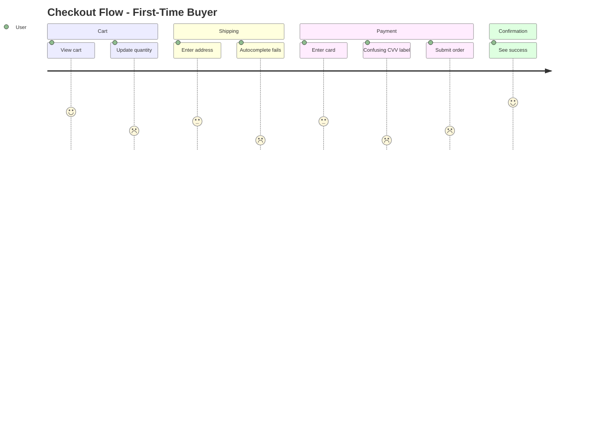
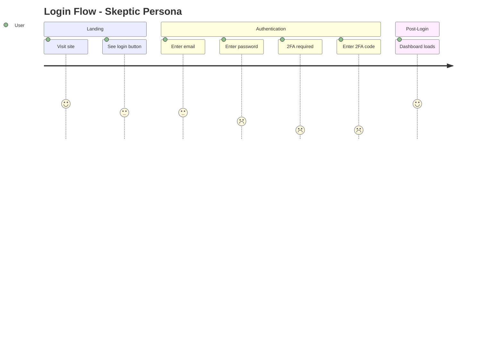
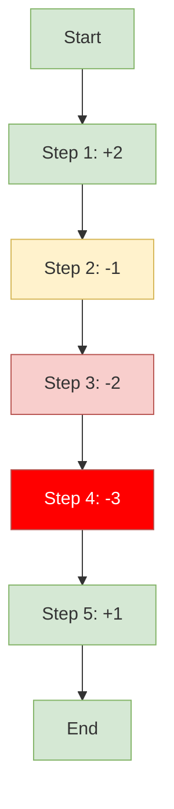
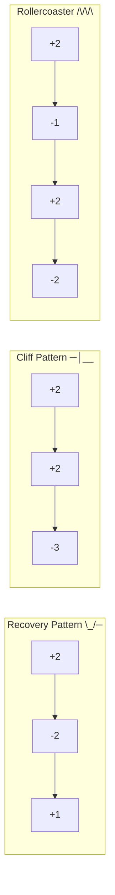
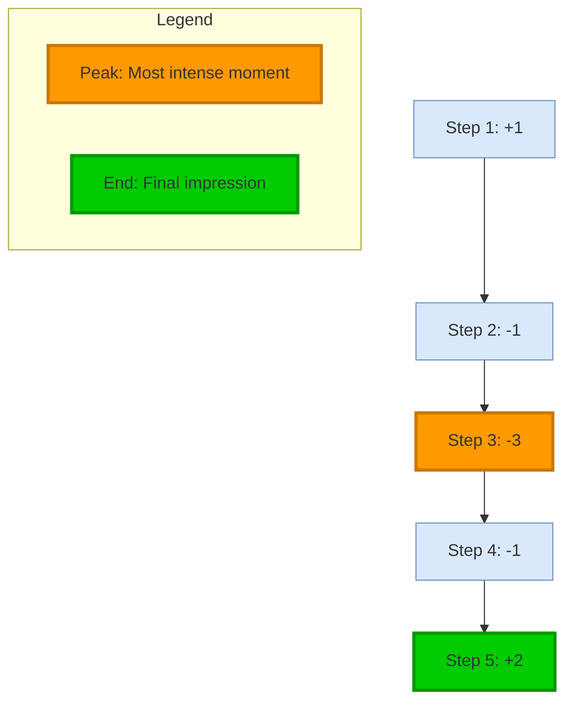

# Canvas Echo Integration Reference

Echo エージェントとの連携詳細。Journey Map、Emotion Score 可視化、Cross-Persona 比較。

---

## Overview

```
┌─────────────────────────────────────────────────────────────┐
│                      ECHO                                    │
│  Persona walkthrough → Emotion scores → Journey data        │
└─────────────────────┬───────────────────────────────────────┘
                      ↓
┌─────────────────────────────────────────────────────────────┐
│                     CANVAS                                   │
│  Journey Map / Friction Heatmap / Cross-Persona Matrix      │
└─────────────────────────────────────────────────────────────┘
```

---

## Handoff Format (Echo → Canvas)

### Standard Journey Data

```markdown
## Echo → Canvas Journey Visualization

**Flow**: [フロー名]
**Persona**: [ペルソナ名]
**Average Score**: [平均スコア]

**Journey Data**:
| Step | Action | Score | Friction Type |
|------|--------|-------|---------------|
| 1 | Land on page | +2 | None |
| 2 | Find signup | -1 | Mental Model Gap |
| 3 | Fill form | -2 | Cognitive Overload |
| 4 | Submit | -3 | Error Handling |
| 5 | Confirmation | +1 | Recovery |

**Highlight Points**:
- Peak: Step 2 (+2)
- Valley: Step 4 (-3)
- End: Step 5 (+1)

→ `/Canvas visualize journey`
```

### Cross-Persona Data

```markdown
## Echo → Canvas Cross-Persona Visualization

**Flow**: [フロー名]
**Personas**: [ペルソナリスト]

**Comparison Matrix**:
| Step | Newbie | Power | Mobile | Senior | Issue Type |
|------|--------|-------|--------|--------|------------|
| 1 | +1 | +2 | +1 | +1 | Non-Issue |
| 2 | -2 | +1 | -2 | -3 | Segment |
| 3 | -3 | -2 | -3 | -3 | Universal |

**Analysis**:
- Universal Issues: Step 3
- Segment Issues: Step 2 (affects Newbie, Mobile, Senior)

→ `/Canvas visualize cross-persona`
```

---

## Journey Map Templates

### Mermaid Journey with Emotion Curve



### Enhanced Journey with Friction Markers



---

## Friction Heatmap

フロー内の摩擦ポイントを色で可視化。

### Mermaid Flowchart with Color Coding



### Color Scale

| Score | Color | CSS Class | Hex |
|-------|-------|-----------|-----|
| +3, +2 | Green | `positive` | #d5e8d4 |
| +1, 0 | Yellow | `neutral` | #fff2cc |
| -1 | Orange | `warning` | #ffe6cc |
| -2 | Red | `negative` | #f8cecc |
| -3 | Dark Red | `critical` | #ff0000 |

---

## Cross-Persona Comparison Visualization

### Grouped Bar Chart (ASCII)

```
Checkout Flow - Cross-Persona Emotion Scores

Step 1 (View Cart)
  Newbie   ████████░░ +2
  Power    ██████████ +3
  Mobile   ████████░░ +2
  Senior   ██████░░░░ +1

Step 2 (Enter Address)
  Newbie   ████░░░░░░ -1
  Power    ████████░░ +2
  Mobile   ██░░░░░░░░ -2
  Senior   ░░░░░░░░░░ -3  ← Segment Issue

Step 3 (Payment)
  Newbie   ░░░░░░░░░░ -3  ← Universal Issue
  Power    ██░░░░░░░░ -2
  Mobile   ░░░░░░░░░░ -3
  Senior   ░░░░░░░░░░ -3

Legend: ██ Positive  ░░ Negative
```

### Mermaid XY Chart

```mermaid
xychart-beta
    title "Cross-Persona Emotion Scores"
    x-axis [Step1, Step2, Step3, Step4, Step5]
    y-axis "Score" -3 --> 3
    line [2, -1, -3, -2, 1] "Newbie"
    line [3, 2, -2, -1, 2] "Power"
    line [2, -2, -3, -2, 1] "Mobile"
```

---

## Emotion Trend Patterns

### Pattern Recognition Visualization



---

## Peak-End Visualization

ユーザー体験の記憶に残るポイントを強調。



---

## Saved Persona Journey Integration

Echo の保存済みペルソナと Canvas の保存済み図を連携。

### Workflow

```
1. Echo loads persona from .agents/personas/{service}/
2. Echo performs walkthrough, generates journey data
3. Canvas receives journey data
4. Canvas checks for existing journey in .agents/diagrams/{project}/
5. Canvas updates or creates journey diagram
6. Canvas saves to library with persona reference
```

### File Linking

```markdown
---
name: checkout-journey-first-time-buyer
type: journey
format: mermaid
persona: .agents/personas/ec-platform/first-time-buyer.md
flow: checkout
created: 2026-01-31
---
```

---

## Question Templates

### ON_JOURNEY_VISUALIZATION

```yaml
questions:
  - question: "Journeyデータをどの形式で可視化しますか？"
    header: "Format"
    options:
      - label: "Mermaid Journey (Recommended)"
        description: "標準的なジャーニーマップ"
      - label: "Friction Heatmap"
        description: "摩擦ポイントを色で可視化"
      - label: "Emotion Trend Chart"
        description: "感情スコアの推移グラフ"
      - label: "ASCII Journey"
        description: "テキストベースのジャーニー"
    multiSelect: false
```

### ON_CROSS_PERSONA_FORMAT

```yaml
questions:
  - question: "Cross-Persona比較をどの形式で可視化しますか？"
    header: "Format"
    options:
      - label: "Comparison Matrix (Recommended)"
        description: "ペルソナ×ステップのマトリクス"
      - label: "Overlay Chart"
        description: "複数ペルソナの重ね合わせグラフ"
      - label: "Issue Highlight"
        description: "Universal/Segment Issueを強調"
    multiSelect: false
```

### ON_JOURNEY_SAVE

```yaml
questions:
  - question: "生成したJourneyをライブラリに保存しますか？"
    header: "Save"
    options:
      - label: "Yes, save with persona link (Recommended)"
        description: "ペルソナファイルへの参照付きで保存"
      - label: "Save without link"
        description: "参照なしで保存"
      - label: "Don't save"
        description: "今回は保存しない"
    multiSelect: false
```

---

## Output Examples

### Journey Map Report

```markdown
## Canvas Journey Map

### Checkout Flow - First-Time Buyer

**Purpose:** 初回購入者のチェックアウト体験を可視化
**Persona:** First-Time Buyer (.agents/personas/ec-platform/first-time-buyer.md)
**Format:** Mermaid Journey
**Average Score:** -0.5 (改善必要)

### Diagram

[Mermaid code]

### Key Findings

| 指標 | 値 | 評価 |
|------|-----|------|
| Peak (最低点) | Step 4: -3 | 要対応 |
| End (終点) | Step 5: +1 | 良好 |
| Pattern | Recovery (\_/─) | 回復傾向 |

### Recommended Actions

1. Step 4 の摩擦を解消（優先度: 高）
2. Step 2-3 の認知負荷を軽減

### Sources

- Echo walkthrough: 2026-01-31
- Persona: first-time-buyer.md
```
