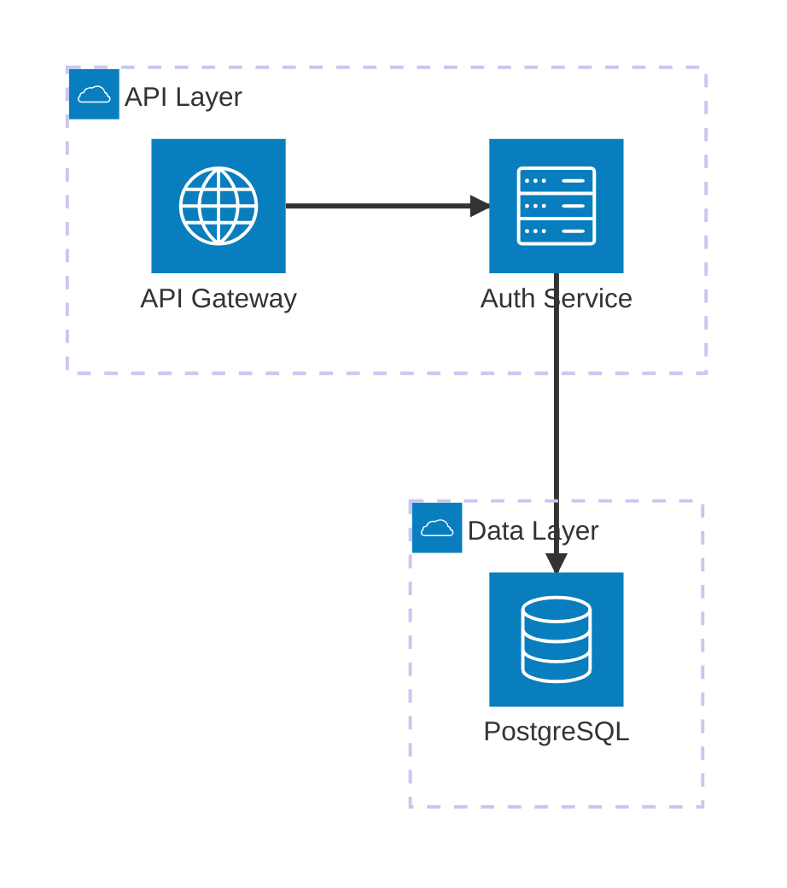
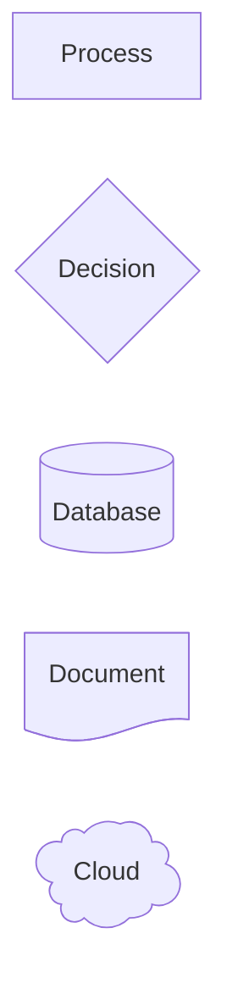
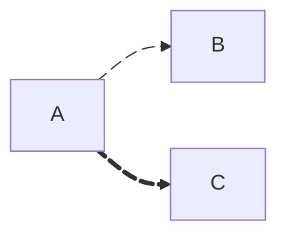
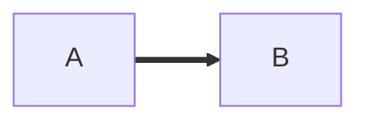
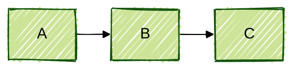
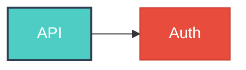

# Mermaid v11 Advanced Features

> v11 新ダイアグラム、セマンティックシェイプ、エッジID/アニメーション、Frontmatter設定、ELKレイアウト、テーマ、アンチパターン

## 1. v11 新ダイアグラムタイプ

| タイプ | バージョン | 用途 |
|--------|-----------|------|
| Architecture | v11.1.0+ | クラウド/CI/CDサービス関係図 |
| Kanban | v11+ | タスクボード |
| Packet | v11+ | ネットワークパケット構造 |
| Block Diagram | v11+ | ブロックベースアーキテクチャ |
| Radar | 最新 | 多軸パフォーマンス指標 |

### Architecture ダイアグラム



デフォルトアイコン: `cloud`, `database`, `disk`, `internet`, `server`。iconify.design の 200,000+ アイコンも利用可能。

---

## 2. セマンティックシェイプ (v11.3.0+)

`@{}` 構文で30+のシェイプを利用可能:



主要シェイプ: `rect`, `rounded`, `diam`, `lean-r`, `fr-rect`, `cyl`, `doc`, `sl-rect`, `multi-document`, `manual-file`, `priority`, `delay`, `cloud`, `bang`, `card`

---

## 3. エッジID・アニメーション (v11+)



### エッジ別カーブ (v11.10.0+)



カーブ: `basis`, `bumpX`, `bumpY`, `cardinal`, `catmullRom`, `linear`, `monotoneX`, `monotoneY`, `natural`, `step`, `stepAfter`, `stepBefore`

### アイコン・画像シェイプ


---

## 4. Frontmatter 設定 (推奨、v10.5.0+)

旧 `%%{init:}%%` ディレクティブは非推奨。YAML Frontmatter を使用:



### base テーマのカスタマイズ

```mermaid
---
config:
  theme: base
  themeVariables:
    primaryColor: "#ff6b6b"
    primaryTextColor: "#333"
    primaryBorderColor: "#ff4757"
    lineColor: "#636e72"
---
```

**重要**: テーマエンジンは16進数カラーのみ認識。`red` ではなく `#ff0000` を使用。

### 5つの組み込みテーマ

| テーマ | 用途 |
|--------|------|
| `default` | 標準 |
| `neutral` | 白黒印刷向け |
| `dark` | ダークモード |
| `forest` | 緑系 |
| `base` | カスタマイズ可能 (唯一) |

---

## 5. ELK レイアウト

大規模ダイアグラム (100ノード超) で推奨:

```yaml
---
config:
  layout: elk
  elk:
    mergeEdges: true
    nodePlacementStrategy: BRANDES_KOEPF
---
```

| エンジン | 推奨ケース |
|---------|-----------|
| Dagre (デフォルト) | 100ノード未満の小〜中規模 |
| **ELK** | 100ノード以上、オーバーラップ軽減 |

ELK は v11 で別パッケージに分離。必要時のみインポート。

---

## 6. スタイリングパターン

### classDef



一括適用: `class NodeA,NodeB primary;`

### 不可視要素でレイアウト制御

```mermaid
flowchart LR
    B ~~~ C  %% 不可視リンクで近接を誘導
```

### クリックイベント

```mermaid
click A href "https://docs.example.com" "Open docs" _blank
```

**注意**: `securityLevel: 'loose'` 必須。`strict` (デフォルト) では警告なしで無効化。

---

## 7. コーディング規約

| 規約 | 説明 |
|------|------|
| ノード先宣言、関係後定義 | 可読性・保守性向上 |
| 自己説明的ID | `A` → `UserInput["User Input"]` |
| パイプ構文 | `A -->\|"label"\| B` (明確) |
| コメントでセクション分割 | `%% Authentication flow` |
| 共有ノードは独立行で定義 | 複数の接続元から参照 |

---

## 8. アンチパターン

| # | パターン | 問題 | 修正 |
|---|---------|------|------|
| 1 | `end` のベアワード使用 | パーサーがサブグラフ/ステート終了と誤認 | 引用符で囲む: `"End Process"` |
| 2 | コメント内のブラケット | パーサー混乱 | コメントに `{}` を使わない |
| 3 | 100ノード超の単一図 | レイアウト崩壊、パフォーマンス低下 | 分割 + ELK |
| 4 | React DOM 競合 | Mermaid の直接 DOM 操作が仮想 DOM と衝突 | `useEffect` で初期化、`key` で制御 |
| 5 | フォント読み込み前のレンダリング | ラベルがバウンドから外れる | DOM + アセット完全読み込み後に実行 |
| 6 | レイアウトのピクセル制御 | Mermaid はカオス的レイアウト | 精密制御が必要なら D2 を検討 |
| 7 | 旧ディレクティブ使用 | `%%{init:}%%` は非推奨 | YAML Frontmatter に移行 |

---

## 9. パフォーマンス最適化

```yaml
---
config:
  flowchart:
    diagramPadding: 8
    nodeSpacing: 30
    rankSpacing: 30
---
```

- ダイアグラムの分割 (100ノード超)
- `maxEdges`, `maxTextSize` で制約
- サブグラフで関連ノードをグループ化
- 不要なエッジを最小限に

### セキュリティ設定

| レベル | 推奨用途 |
|--------|---------|
| `strict` (デフォルト) | 信頼できないコンテンツ |
| `antiscript` | 中間レベル |
| `loose` | 信頼できるコンテンツのみ |
| `sandbox` | 最高セキュリティ (iframe) |

**Source:** [Mermaid v11 Announcement](https://mermaid.ai/docs/blog/posts/mermaid-v11) · [Mermaid Syntax Reference](https://mermaid.js.org/intro/syntax-reference.html) · [Mermaid Theme Configuration](https://mermaid.ai/open-source/config/theming.html) · [Mastering Mermaid.js (Antoine Griffard)](https://antoinegriffard.com/posts/mermaid-js-comprehensive-guide/)
