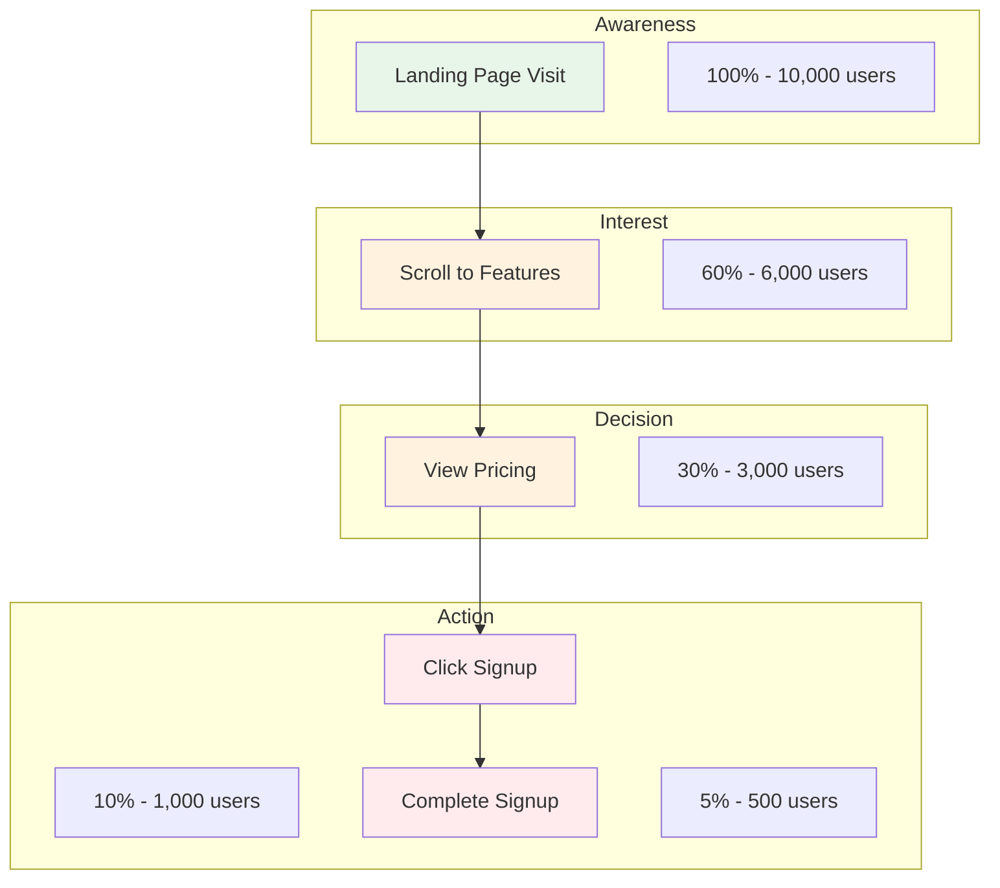
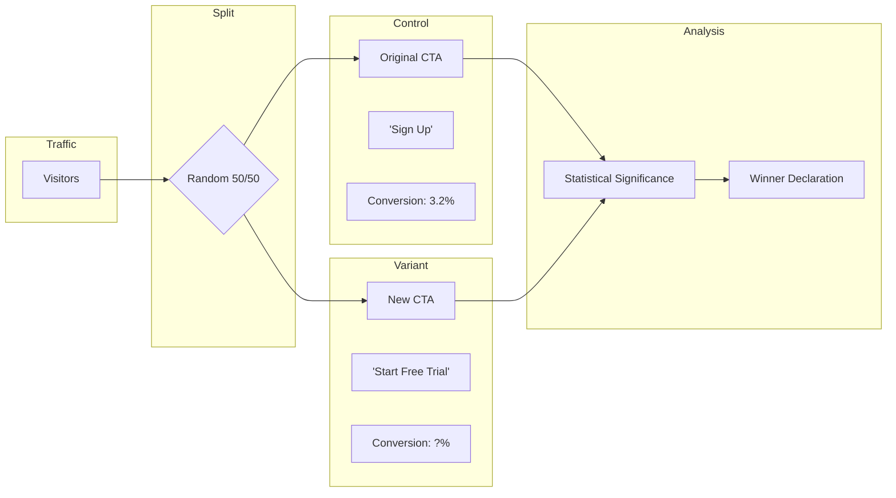
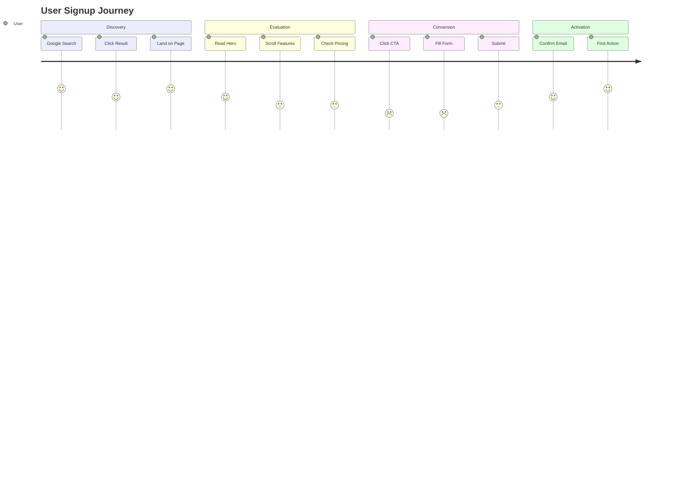

# Collaboration & Handoff Templates

## Bolt Integration

### Performance Optimization Flow

When Growth identifies performance issues affecting SEO:

1. **Growth identifies** - Core Web Vitals failing or slow page speed
2. **Create proposal** - Document performance bottlenecks
3. **Hand off to Bolt** - `/Bolt optimize performance`
4. **Bolt implements** - Applies performance optimizations

### Growth → Bolt Performance Request

```markdown
## Growth → Bolt Performance Request

**Issue:** [Core Web Vitals failing | Slow page load | Poor mobile performance]

**Current Metrics:**
- LCP: [X.Xs] (target: < 2.5s)
- INP: [Xms] (target: < 200ms)
- CLS: [X.XX] (target: < 0.1)
- PageSpeed Score: [X/100]

**Identified Bottlenecks:**
1. [Large unoptimized images]
2. [Render-blocking JavaScript]
3. [No caching headers]

**Affected Pages:**
- [/page-url] - [specific issue]

**Impact on Growth:**
- SEO ranking affected by Core Web Vitals
- High bounce rate due to slow load

**Requested Optimizations:**
- [ ] Image optimization (WebP, srcset)
- [ ] Code splitting and lazy loading
- [ ] Font optimization
- [ ] Caching strategy

Suggested command: `/Bolt optimize performance`
```

### Growth → Bolt LCP Optimization

```markdown
## Growth → Bolt LCP Optimization

**Current LCP:** [X.Xs]
**Target LCP:** < 2.5s
**LCP Element:** [Hero image | Heading | Video]

**Proposed Fixes:**
1. Preload LCP element
2. Optimize image format/size
3. Implement SSR/SSG for critical content

Suggested command: `/Bolt fix LCP`
```

---

## Canvas Integration

### Conversion Funnel Diagram Request

```
/Canvas create conversion funnel diagram:
- Stages: [Awareness, Interest, Decision, Action]
- Drop-off rates at each stage
- Key metrics per stage
- Optimization opportunities
```

### User Flow Diagram Request

```
/Canvas create user flow diagram for [feature]:
- Entry points
- Decision points
- Conversion paths
- Exit points
- Friction points to optimize
```

### A/B Test Design Diagram Request

```
/Canvas create A/B test diagram:
- Control vs Variant
- Hypothesis
- Primary/secondary metrics
- Sample size requirements
- Test duration
```

### Canvas Output Examples

**Conversion Funnel (Mermaid):**


**A/B Test Design (Mermaid):**


**User Journey (Mermaid):**


---

## Handoff Templates

### GROWTH_TO_EXPERIMENT_HANDOFF

```markdown
## EXPERIMENT_HANDOFF (from Growth)

### CRO Hypothesis
- **Page:** [URL/component]
- **Current conversion:** [X%]
- **Hypothesis:** [Changing X will improve Y because Z]
- **Proposed variants:** [List of variants]

### Measurement
- **Primary metric:** [Conversion rate of specific action]
- **Secondary metrics:** [Bounce rate, time on page, etc.]

Suggested command: `/Experiment design test for [page]`
```

### GROWTH_TO_BOLT_HANDOFF

```markdown
## BOLT_HANDOFF (from Growth)

### Performance Issues Found
- **Page:** [URL]
- **LCP:** [X ms] (target: < 2500ms)
- **CLS:** [X] (target: < 0.1)
- **INP:** [X ms] (target: < 200ms)

### Priority Fixes
1. [Largest Contentful Paint issue]
2. [Layout shift cause]
3. [Interaction delay cause]

Suggested command: `/Bolt optimize performance for [page]`
```
