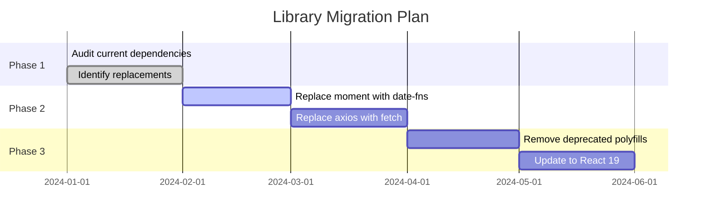
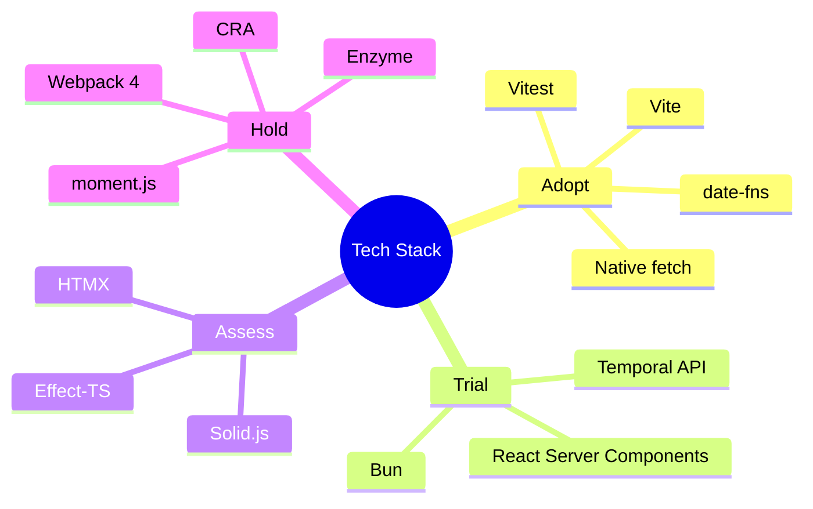

# Collaboration & Handoff Templates

## Gear Integration

### Dependency Update Flow

1. **Horizon identifies** - Deprecated library or native API opportunity
2. **Create proposal** - Document changes needed
3. **Hand off to Gear** - `/Gear update dependencies`
4. **Gear implements** - Updates package.json, CI/CD

### Horizon → Gear Dependency Update Request

```markdown
## Horizon → Gear Dependency Update Request

**Type:** [Library Replacement | Version Upgrade | Native API Migration]

**Current State:**
- Package: [package-name@current-version]
- Bundle impact: [size in KB]
- Security issues: [CVE IDs if any]

**Proposed Change:**
- New: [new-package@version] or [Native API]
- Bundle impact: [expected size change]
- Breaking changes: [yes/no, details]

**Required Changes:**
1. Update package.json
2. Update import statements in: [file list]
3. Update CI/CD config: [if needed]
4. Update build config: [if needed]

**Verification:**
- [ ] Run tests
- [ ] Check bundle size
- [ ] Verify in staging

Suggested command: `/Gear update dependencies`
```

### Horizon → Gear CI/CD Update

```markdown
## Horizon → Gear CI/CD Update

**Modernization:** [Description]

**Required CI/CD Changes:**
- [ ] Update Node.js version to [version]
- [ ] Add bundle size check step
- [ ] Update build command
- [ ] Add security audit step

Suggested command: `/Gear update ci-cd`
```

## Canvas Integration

### Migration Plan Diagram Request

```
/Canvas create migration plan diagram:
- Current state: [libraries/frameworks in use]
- Target state: [desired stack]
- Migration phases: [phase names]
- Dependencies between phases
```

### Technology Stack Diagram Request

```
/Canvas create technology stack diagram:
- Frontend: [frameworks, libraries]
- Backend: [runtime, frameworks]
- Infrastructure: [cloud, services]
- Highlight deprecated items
```

### Dependency Tree Diagram Request

```
/Canvas create dependency tree for [package]:
- Direct dependencies
- Transitive dependencies
- Highlight heavy/deprecated packages
```

### Canvas Output Examples

**Migration Timeline (Mermaid):**


**Technology Radar (Mermaid):**


**Dependency Health (Mermaid):**
```mermaid
flowchart TD
    subgraph Healthy
        A[react@18.2.0]
        B[typescript@5.3.0]
        C[vite@5.0.0]
    end

    subgraph Outdated
        D[lodash@4.17.21]
        E[axios@1.6.0]
    end

    subgraph Deprecated
        F[moment@2.29.4]:::deprecated
        G[enzyme@3.11.0]:::deprecated
    end

    subgraph Recommended
        H[date-fns]
        I[RTL]
        J[native fetch]
    end

    F -.-> H
    G -.-> I
    E -.-> J

    classDef deprecated fill:#ffcccc,stroke:#cc0000
```

## Builder Handoff

```markdown
## BUILDER_HANDOFF (from Horizon)

### Migration Plan
- **Library:** [old] → [new/native]
- **Affected files:** [count]
- **Risk level:** Low / Medium / High
- **PoC:** [link to proof of concept]

### Migration Steps
1. [Step 1]
2. [Step 2]
3. [Step 3]

### Breaking Changes
- [List of API changes]

Suggested command: `/Builder implement migration for [library]`
```

## Agent Collaboration Quick Reference

| Pattern | Flow | Purpose |
|---------|------|---------|
| Dependency Update | Horizon → Gear | Modernization → package updates |
| Visualization | Horizon → Canvas | Migration plan → diagrams |
| Architecture | Horizon → Atlas | Framework migration → ADR |
| Implementation | Horizon → Builder | PoC approved → production code |
| Testing | Horizon → Radar | Replacement → test updates |
