# Orbit Script Processing Flow

## Overall Lifecycle

```mermaid
graph TB
    subgraph BOOTSTRAP["bootstrap.sh — 初期化"]
        B1[mkdir LOOP_DIR] --> B2[goal.md 生成]
        B2 --> B3[progress.md 生成<br/>Iteration 0 — Bootstrap]
        B3 --> B4[state.env 生成<br/>NEXT_ITERATION=1<br/>LAST_STATUS=READY]
        B4 --> B5{VERIFY_CMD<br/>指定あり?}
        B5 -->|Yes| B6[verify.sh 生成]
        B5 -->|No| B7[スキップ]
        B6 --> B8([Bootstrap Complete])
        B7 --> B8
    end

    B8 --> R0

    subgraph RUNNER["run-loop.sh — メインループ"]
        R0[State 読み込み<br/>state.env or defaults] --> R1

        subgraph DIRTY["Dirty Baseline Snapshot"]
            R1{AUTOCOMMIT<br/>== true?} -->|Yes| R2["git diff --name-only<br/>→ dirty-start-paths.txt"]
            R1 -->|No| R3[スキップ]
        end

        R2 --> LOOP
        R3 --> LOOP

        subgraph LOOP["while STATUS != DONE && iter <= MAX"]
            L0["=== Iteration N ==="] --> EXEC

            subgraph EXEC["Bounded Retry Execution"]
                E1["EXEC_CMD 実行<br/>(codex exec / claude / gemini)"] --> E2{成功?}
                E2 -->|Yes| E3([exec_success = true])
                E2 -->|No| E4{retry_count<br/>< RETRY_LIMIT?}
                E4 -->|Yes| E5["sleep(BACKOFF^retry)"] --> E1
                E4 -->|No| E6["BLOCKED<br/>progress.md に TOOL_FAILURE 記録"] --> BREAK([break — ループ離脱])
            end

            E3 --> VERIFY

            subgraph VERIFY["Verification Gate"]
                V1{verify.sh<br/>存在?} -->|Yes| V2[bash verify.sh]
                V1 -->|No| V3["VERIFY_RESULT = SKIP"]
                V2 --> V4{exit code}
                V4 -->|0| V5["VERIFY_RESULT = PASS"]
                V4 -->|≠0| V6["VERIFY_RESULT = FAIL"]
            end

            V5 --> COMMIT
            V6 --> COMMIT
            V3 --> COMMIT

            subgraph COMMIT["Scoped Auto-Commit"]
                C1{AUTOCOMMIT?} -->|No| C5[スキップ]
                C1 -->|Yes| C2{dirty baseline<br/>存在?}
                C2 -->|Yes| C3["comm -23 で baseline 除外<br/>ループ成果物のみ git add"]
                C2 -->|No| C4[git add -A]
                C3 --> C6{staged<br/>changes?}
                C4 --> C6
                C6 -->|Yes| C7["git commit -m<br/>loop(iter-N): auto-commit<br/>[verify=RESULT]"]
                C6 -->|No| C8[コミットなし]
            end

            C5 --> DONE_CHECK
            C7 --> DONE_CHECK
            C8 --> DONE_CHECK

            subgraph DONE_CHECK["DONE Detection"]
                D1{done.md<br/>存在?} -->|No| D2["STATUS = CONTINUE"]
                D1 -->|Yes| D3{VERIFY_RESULT<br/>== PASS or SKIP?}
                D3 -->|Yes| D4["STATUS = DONE"]
                D3 -->|No| D5["STATUS = CONTINUE<br/>(done.md あるが検証失敗)"]
            end

            D2 --> STATE_WRITE
            D4 --> STATE_WRITE
            D5 --> STATE_WRITE

            subgraph STATE_WRITE["State Update"]
                S1["NEXT_ITERATION++"] --> S2["state.env 原子書き込み<br/>NEXT_ITERATION / LAST_STATUS / LAST_UPDATED_AT"]
            end
        end

        S2 -->|CONTINUE| L0
        S2 -->|DONE| FOOTER
        BREAK --> FOOTER

        subgraph FOOTER["Status Footer"]
            F1["NEXUS_LOOP_STATUS: {STATUS}"]
            F2["NEXUS_LOOP_SUMMARY: Iteration N/MAX, status={STATUS}"]
        end
    end

    style BOOTSTRAP fill:#1a3a2a,stroke:#4ade80
    style RUNNER fill:#1a2a3a,stroke:#60a5fa
    style EXEC fill:#2a2a1a,stroke:#fbbf24
    style VERIFY fill:#2a1a2a,stroke:#c084fc
    style COMMIT fill:#1a2a2a,stroke:#22d3ee
    style DONE_CHECK fill:#2a1a1a,stroke:#f87171
    style FOOTER fill:#0a2a1a,stroke:#34d399
```



## Recovery Flow (recover.sh)

```mermaid
graph LR
    subgraph RECOVER["recover.sh — 状態復旧"]
        RC1["progress.md から<br/>最終 Iteration 番号を抽出"] --> RC2["末尾20行から<br/>STATUS を判定"]
        RC2 --> RC3{キーワード検出}
        RC3 -->|DONE| RC4["RECOVERED = DONE"]
        RC3 -->|BLOCKED/FAIL| RC5["RECOVERED = BLOCKED"]
        RC3 -->|それ以外| RC6["RECOVERED = CONTINUE"]
        RC4 --> RC7["state.env 再構築<br/>NEXT = latest_iter + 1<br/>RECOVERED_FROM = progress_evidence"]
        RC5 --> RC7
        RC6 --> RC7
        RC7 --> RC8["progress.md に<br/>Recovery ノート追記"]
    end

    style RECOVER fill:#2a2a1a,stroke:#fbbf24
```



## Verification Check Structure (verify.sh)

```mermaid
graph TD
    subgraph VER["verify.sh — 受け入れ条件チェック"]
        VC1["PASS=0, FAIL=0"] --> VC2
        VC2["run_check 'チェック名' コマンド"] --> VC3{exit code}
        VC3 -->|0| VC4["[PASS] +1"]
        VC3 -->|≠0| VC5["[FAIL] +1"]
        VC4 --> VC6["... 全チェック繰り返し ..."]
        VC5 --> VC6
        VC6 --> VC7{"FAIL > 0?"}
        VC7 -->|Yes| VC8["exit 1<br/>(検証失敗 → DONE 阻止)"]
        VC7 -->|No| VC9["exit 0<br/>(検証成功 → DONE 許可)"]
    end

    style VER fill:#2a1a2a,stroke:#c084fc
```



## Inter-Script Relationships

```
bootstrap.sh ──生成──→ goal.md
                       progress.md
                       state.env
                       verify.sh (optional)

run-loop.sh  ──読込──→ state.env (resume point)
             ──参照──→ goal.md (exec cmd に渡す)
             ──更新──→ progress.md (障害記録)
             ──呼出──→ verify.sh (検証ゲート)
             ──検査──→ done.md (DONE 判定)
             ──書込──→ state.env (原子的更新)
             ──出力──→ runner.log (全ログ)
             ──出力──→ NEXUS_LOOP_STATUS footer

recover.sh   ──読込──→ progress.md (証跡ソース)
             ──書込──→ state.env (再構築)
             ──追記──→ progress.md (復旧ノート)
```

## Key Design Points

- **DONE 二重ゲート**: `done.md` の存在だけでは不十分。`verify.sh` が PASS または SKIP であることも必要
- **Bounded Retry + Timeout**: 無限リトライを防止。`RETRY_LIMIT` 回で CONTINUE (TOOL_FAILURE) に遷移。`EXEC_TIMEOUT` でハングしたプロセスも自動終了
- **Dirty Baseline Isolation**: ループ開始前の未コミット変更（修正済・ステージ済・未追跡の全3種）を `dirty-start-paths.txt` に記録し、auto-commit から除外
- **Atomic State Write**: `state.env` を毎イテレーション末に上書き。中断しても resume 可能
- **Graceful Shutdown**: SIGINT/SIGTERM をトラップし、state.env を安全に書き込んでから終了
- **State Validation**: `source state.env` 前にフォーマットを検証。破損した state.env による任意コマンド実行を防止
- **Contract-Valid Statuses Only**: `NEXUS_LOOP_STATUS` は `READY` / `CONTINUE` / `DONE` のみ。TOOL_FAILURE は `CONTINUE` + progress.md 記録で表現
- **Recovery from Evidence**: `recover.sh` は `progress.md` を唯一の真実として `state.env` を再構築（POSIX 互換 grep 使用）
