# Orbit Script Processing Flow

## Overall Lifecycle

```mermaid
graph TB
    subgraph BOOTSTRAP["bootstrap.sh — Initialize"]
        B1[mkdir LOOP_DIR] --> B2[create goal.md]
        B2 --> B3[create progress.md<br/>Iteration 0 — Bootstrap]
        B3 --> B4[create state.env<br/>NEXT_ITERATION=1<br/>LAST_STATUS=READY]
        B4 --> B5{VERIFY_CMD<br/>specified?}
        B5 -->|Yes| B6[generate verify.sh]
        B5 -->|No| B7[skip]
        B6 --> B8([Bootstrap Complete])
        B7 --> B8
    end

    B8 --> R0

    subgraph RUNNER["run-loop.sh — Main Loop"]
        R0[Load state<br/>state.env or defaults] --> R1

        subgraph DIRTY["Dirty Baseline Snapshot"]
            R1{AUTOCOMMIT<br/>== true?} -->|Yes| R2["git diff --name-only<br/>→ dirty-start-paths.txt"]
            R1 -->|No| R3[skip]
        end

        R2 --> LOOP
        R3 --> LOOP

        subgraph LOOP["while STATUS != DONE && iter <= MAX"]
            L0["=== Iteration N ==="] --> EXEC

            subgraph EXEC["Bounded Retry Execution"]
                E1["Run EXEC_CMD<br/>(codex exec / claude / gemini)"] --> E2{success?}
                E2 -->|Yes| E3([exec_success = true])
                E2 -->|No| E4{retry_count<br/>< RETRY_LIMIT?}
                E4 -->|Yes| E5["sleep(BACKOFF^retry)"] --> E1
                E4 -->|No| E6["BLOCKED<br/>record TOOL_FAILURE in progress.md"] --> BREAK([break — exit loop])
            end

            E3 --> VERIFY

            subgraph VERIFY["Verification Gate"]
                V1{verify.sh<br/>exists?} -->|Yes| V2[bash verify.sh]
                V1 -->|No| V3["VERIFY_RESULT = SKIP"]
                V2 --> V4{exit code}
                V4 -->|0| V5["VERIFY_RESULT = PASS"]
                V4 -->|≠0| V6["VERIFY_RESULT = FAIL"]
            end

            V5 --> COMMIT
            V6 --> COMMIT
            V3 --> COMMIT

            subgraph COMMIT["Scoped Auto-Commit"]
                C1{AUTOCOMMIT?} -->|No| C5[skip]
                C1 -->|Yes| C2{dirty baseline<br/>exists?}
                C2 -->|Yes| C3["exclude baseline via comm -23<br/>git add loop artifacts only"]
                C2 -->|No| C4[git add -A]
                C3 --> C6{staged<br/>changes?}
                C4 --> C6
                C6 -->|Yes| C7["git commit -m<br/>loop(iter-N): auto-commit<br/>[verify=RESULT]"]
                C6 -->|No| C8[no commit]
            end

            C5 --> DONE_CHECK
            C7 --> DONE_CHECK
            C8 --> DONE_CHECK

            subgraph DONE_CHECK["DONE Detection"]
                D1{done.md<br/>exists?} -->|No| D2["STATUS = CONTINUE"]
                D1 -->|Yes| D3{VERIFY_RESULT<br/>== PASS or SKIP?}
                D3 -->|Yes| D4["STATUS = DONE"]
                D3 -->|No| D5["STATUS = CONTINUE<br/>(done.md exists but verify failed)"]
            end

            D2 --> STATE_WRITE
            D4 --> STATE_WRITE
            D5 --> STATE_WRITE

            subgraph STATE_WRITE["State Update"]
                S1["NEXT_ITERATION++"] --> S2["atomic write to state.env<br/>NEXT_ITERATION / LAST_STATUS / LAST_UPDATED_AT"]
            end

            S2 --> N1

            subgraph NOTIFY["Iteration Notification (|| true)"]
                N1{NOTIFY_ENABLED?} -->|true| N2{notify.sh<br/>exists?}
                N1 -->|false| N5[skip]
                N2 -->|Yes| N3["Generate text<br/>(Gemini / fallback)"]
                N2 -->|No| N5
                N3 --> N4["Play TTS<br/>(edge-tts → say → text only)"]
                N4 --> N5
            end
        end

        N5 -->|CONTINUE| L0
        N5 -->|DONE| FOOTER
        BREAK --> FOOTER

        subgraph FOOTER["Status Footer"]
            F1["NEXUS_LOOP_STATUS: {STATUS}"]
            F2["NEXUS_LOOP_SUMMARY: Iteration N/MAX, status={STATUS}"]
        end
    end

    style BOOTSTRAP fill:#1a3a2a,stroke:#4ade80
    style RUNNER fill:#1a2a3a,stroke:#60a5fa
    style EXEC fill:#2a2a1a,stroke:#fbbf24
    style VERIFY fill:#2a1a2a,stroke:#c084fc
    style COMMIT fill:#1a2a2a,stroke:#22d3ee
    style DONE_CHECK fill:#2a1a1a,stroke:#f87171
    style NOTIFY fill:#1a2a2a,stroke:#a78bfa
    style FOOTER fill:#0a2a1a,stroke:#34d399
```



## Recovery Flow (recover.sh)

```mermaid
graph LR
    subgraph RECOVER["recover.sh — State Recovery"]
        RC1["Extract latest<br/>iteration from progress.md"] --> RC2["Determine STATUS<br/>from last 20 lines"]
        RC2 --> RC3{keyword match}
        RC3 -->|DONE| RC4["RECOVERED = DONE"]
        RC3 -->|BLOCKED/FAIL| RC5["RECOVERED = BLOCKED"]
        RC3 -->|other| RC6["RECOVERED = CONTINUE"]
        RC4 --> RC7["Rebuild state.env<br/>NEXT = latest_iter + 1<br/>RECOVERED_FROM = progress_evidence"]
        RC5 --> RC7
        RC6 --> RC7
        RC7 --> RC8["Append recovery note<br/>to progress.md"]
    end

    style RECOVER fill:#2a2a1a,stroke:#fbbf24
```



## Verification Check Structure (verify.sh)

```mermaid
graph TD
    subgraph VER["verify.sh — Acceptance Check"]
        VC1["PASS=0, FAIL=0"] --> VC2
        VC2["run_check 'check name' command"] --> VC3{exit code}
        VC3 -->|0| VC4["[PASS] +1"]
        VC3 -->|≠0| VC5["[FAIL] +1"]
        VC4 --> VC6["... repeat for all checks ..."]
        VC5 --> VC6
        VC6 --> VC7{"FAIL > 0?"}
        VC7 -->|Yes| VC8["exit 1<br/>(verify fail → block DONE)"]
        VC7 -->|No| VC9["exit 0<br/>(verify pass → allow DONE)"]
    end

    style VER fill:#2a1a2a,stroke:#c084fc
```



## Inter-Script Relationships

```
bootstrap.sh ──generates──→ goal.md
                             progress.md
                             state.env
                             verify.sh (optional)
                             notify.sh

run-loop.sh  ──reads──────→ state.env (resume point)
             ──reads──────→ goal.md (pass to exec cmd)
             ──updates────→ progress.md (failure log)
             ──calls──────→ verify.sh (verification gate)
             ──calls──────→ notify.sh (notification hook, when NOTIFY_ENABLED)
             ──checks─────→ done.md (DONE detection)
             ──writes─────→ state.env (atomic update)
             ──outputs────→ runner.log (all logs)
             ──outputs────→ NEXUS_LOOP_STATUS footer

notify.sh    ──outputs────→ runner.log (text record)
             ──outputs────→ notify-audio/*.mp3 (audio files)

recover.sh   ──reads──────→ progress.md (evidence source)
             ──writes─────→ state.env (rebuild)
             ──appends────→ progress.md (recovery note)
```

## Key Design Points

- **DONE Dual Gate**: `done.md` existence alone is insufficient. `verify.sh` must also PASS or SKIP
- **Bounded Retry + Timeout**: Prevents infinite retries. Transitions to CONTINUE (TOOL_FAILURE) after `RETRY_LIMIT`. `EXEC_TIMEOUT` auto-terminates hung processes via `portable_timeout` (uses `timeout` on Linux, `gtimeout` or `perl` fallback on macOS)
- **Dirty Baseline Isolation**: Records all uncommitted changes present before loop start (modified, staged, untracked) into `dirty-start-paths.txt` and excludes them from auto-commit
- **Atomic State Write**: Overwrites `state.env` at the end of every iteration. Resumable even after interruption
- **Graceful Shutdown**: Traps SIGINT/SIGTERM and safely writes state.env before exiting
- **State Validation**: Validates format before `source state.env`. Prevents arbitrary command execution from corrupted state.env
- **Contract-Valid Statuses Only**: `NEXUS_LOOP_STATUS` is limited to `READY` / `CONTINUE` / `DONE`. TOOL_FAILURE is represented as `CONTINUE` + progress.md record
- **Recovery from Evidence**: `recover.sh` rebuilds `state.env` using `progress.md` as the sole source of truth (POSIX-compatible grep)
