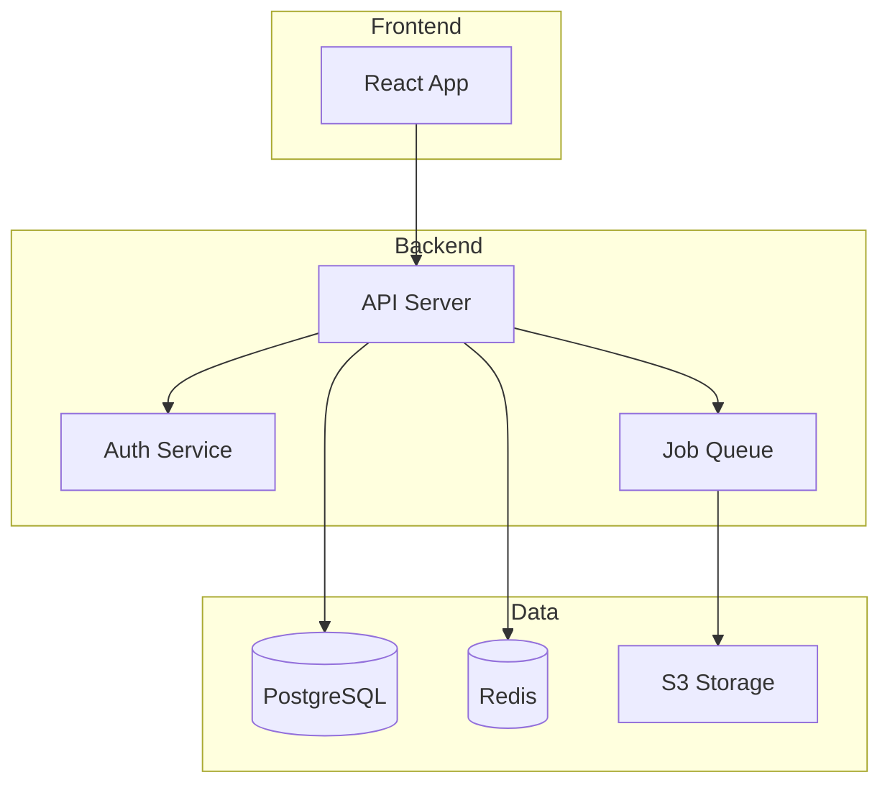
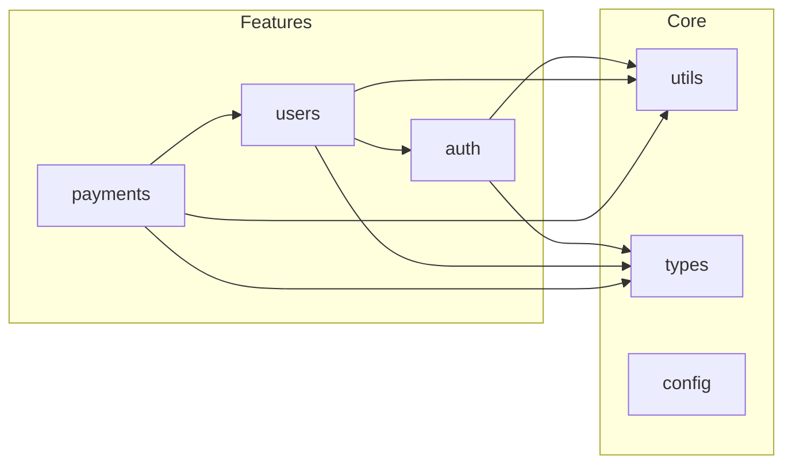

# Agent Collaboration Handoffs

## Atlas Integration

For Architecture Decision Records (ADRs) and architectural documentation.

**When to involve Atlas:**
- Documenting significant design decisions
- Explaining architectural patterns in use
- Recording trade-offs and alternatives considered

### Handoff Template

```markdown
## Quill → Atlas ADR Request

**Decision Needed:** [Brief description]

**Context from Quill:**
- Current documentation gaps: [list]
- Affected components: [list]
- Stakeholders: [who needs to know]

**Technical Details:**
- Current approach: [how it works now]
- Pain points: [what's problematic]
- Constraints: [limitations to consider]

**Request:**
Please create an ADR documenting [specific decision].
Include trade-offs between [option A] and [option B].

Suggested command: `/Atlas create ADR for [topic]`
```

### After Atlas creates ADR

1. Link ADR from relevant code comments
2. Update README if architecture section exists
3. Add to documentation index

```typescript
/**
 * Uses event sourcing pattern for audit trail.
 * @see docs/adr/ADR-005-event-sourcing.md for rationale
 */
```

## Canvas Integration

Request visual diagrams from Canvas for documentation.

### Architecture Overview Request
```
/Canvas create architecture overview diagram:
- Main components/services
- Data flow between components
- External integrations
- Storage/database layers
```

### Data Flow Diagram Request
```
/Canvas create data flow diagram for [feature]:
- Input sources
- Processing steps
- Output destinations
- Error handling paths
```

### Component Relationship Request
```
/Canvas create component diagram showing:
- Module boundaries
- Dependencies between modules
- Public interfaces
- Shared utilities
```

### Embedding Diagrams in Documentation

In README:
```markdown
## Architecture


See [Architecture Decision Records](./docs/adr/) for design rationale.
```

In Code Comments:
```typescript
/**
 * Payment processing flow:
 *
 * User → PaymentService → Gateway → Bank
 *              ↓
 *         AuditLogger
 *
 * @see docs/diagrams/payment-flow.md for detailed diagram
 */
```

## Architecture Overview (Mermaid)



## Module Dependencies (Mermaid)


