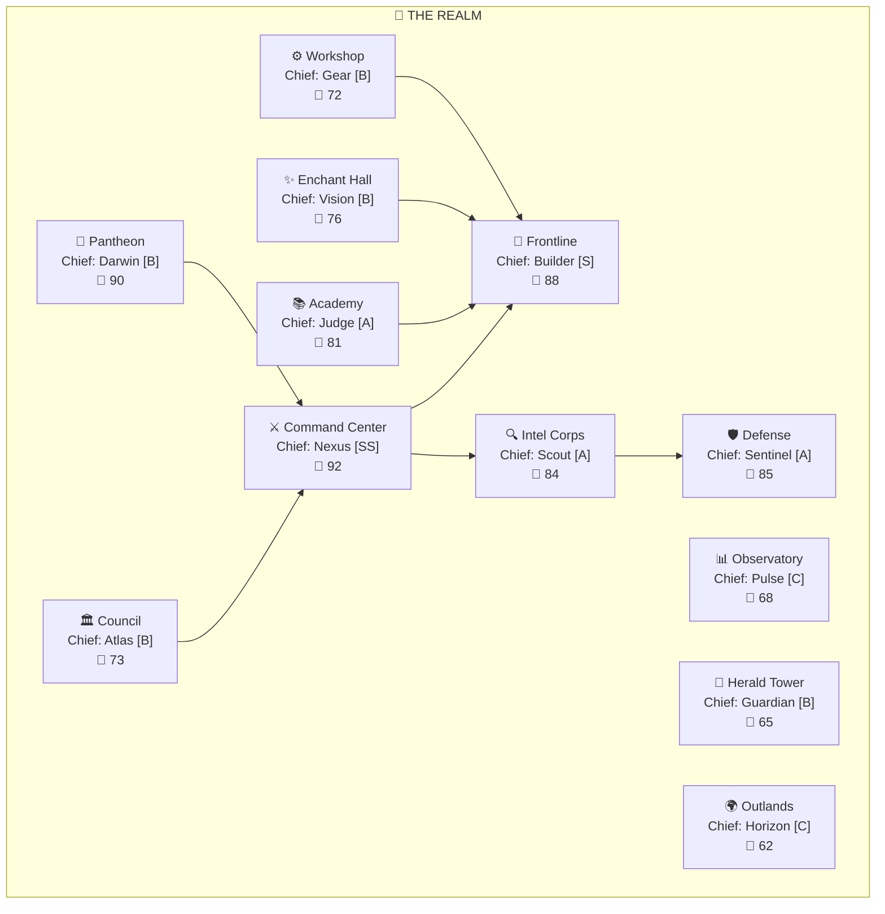

# Visualization Templates

ASCII and Mermaid templates for all Realm visualizations.

---

## 1. Kingdom Dashboard (`/Realm`)

```
╔═══════════════════════════════════════════════════════════════╗
║  🏰 THE REALM — Kingdom Dashboard                            ║
║  Last updated: YYYY-MM-DD HH:MM                              ║
╠═══════════════════════════════════════════════════════════════╣
║                                                               ║
║  KINGDOM STATUS                                               ║
║  ─────────────────────────────────────────                    ║
║  EFS: [██████████████░░] 87/100 (A)  Phase: ACTIVE_BUILD     ║
║  Agents: 63 total · 48 active · 12 stable · 3 dormant        ║
║  Quests: 5 active · 127 complete · 3 failed                  ║
║                                                               ║
║  TOP CHAMPIONS                                                ║
║  ─────────────────────────────────────────                    ║
║  1. ⚔ Nexus      [SS] Commander  XP:31,200  ████████████████ ║
║  2. 🔨 Builder   [S]  Artisan    XP:18,500  █████████████░░░ ║
║  3. 🔍 Scout     [A]  Ranger     XP:12,300  ██████████░░░░░░ ║
║  4. 🛡 Sentinel  [A]  Paladin    XP: 9,800  ████████░░░░░░░░ ║
║  5. 📚 Judge     [A]  Sage       XP: 8,200  ███████░░░░░░░░░ ║
║                                                               ║
║  ACTIVE QUESTS                                                ║
║  ─────────────────────────────────────────                    ║
║  🟣 "The Great API Overhaul"  Party: 6 agents  ██████░░ 75%  ║
║  🔵 "Fortifying Auth Module"  Party: 4 agents  ████░░░░ 50%  ║
║  🟢 "The Config Mystery"      Party: 2 agents  ████████ 95%  ║
║  ⚪ "Chronicling Utils"        Solo: Quill      ██████░░ 60%  ║
║  ⚪ "Daily Type Check"         Solo: Sentinel   █████░░░ 55%  ║
║                                                               ║
║  RECENT EVENTS                                                ║
║  ─────────────────────────────────────────                    ║
║  🎉 Builder ascended to Rank S! (2026-02-28)                 ║
║  ✅ Quest "The Login Fix" completed (2026-02-28)              ║
║  🏅 Scout earned [Centurion] badge (2026-02-27)              ║
║  ⚔ Battle: Incident #47 resolved by Triage→Builder (02-27)  ║
║                                                               ║
║  DEPARTMENT HEALTH                                            ║
║  ─────────────────────────────────────────                    ║
║  ⚔ Command    💚 92  │  🛡 Defense    💚 85  │  📊 Observ  💛 68 ║
║  🔨 Frontline 💚 88  │  📚 Academy   💚 81  │  📯 Herald  💛 65 ║
║  🔍 Intel     💚 84  │  ✨ Enchant   💛 76  │  🌟 Panth   💚 90 ║
║  🏛 Council   💛 73  │  ⚙ Workshop  💛 72  │  🌍 Outland 💛 62 ║
║                                                               ║
║  ECOSYSTEM BADGES: [Kingdom Founded] [Great Expansion]        ║
║                    [Mighty Empire] [United Realm]              ║
║                                                               ║
╚═══════════════════════════════════════════════════════════════╝
```

---

## 2. Character Sheet (`/Realm agent [name]`)

```
╔══════════════════════════════════════════╗
║  ⚔ NEXUS — The Grand Commander          ║
║  Class: Commander · Rank: SS · Lv.99+   ║
╠══════════════════════════════════════════╣
║  STR [██████████] 98↑ (Code Output)     ║
║  DEX [████████░░] 82→ (Versatility)     ║
║  INT [█████████░] 91→ (Complexity)      ║
║  WIS [███████░░░] 74↑ (Learning Rate)   ║
║  CHA [██████████] 99→ (Collaboration)   ║
║  CON [█████████░] 95→ (Reliability)     ║
╠══════════════════════════════════════════╣
║  Power Level: 91  Profile: Well-Rounded  ║
╠══════════════════════════════════════════╣
║  XP: 31,200 / ∞  ████████████████ MAX   ║
╠══════════════════════════════════════════╣
║  Quest Stats:                            ║
║  Total: 312 · ✅ 298 · ⚠️ 10 · ❌ 4     ║
║  ⚪58 · 🟢102 · 🔵89 · 🟣48 · 🟠15     ║
╠══════════════════════════════════════════╣
║  Badges (18):                            ║
║  [👑 Legendary Hero] [🌌 Universal]     ║
║  [💎 Flawless Run] [🏛️ Centurion]      ║
║  [🔥 Eternal Flame] [🎖️ Dept Chief]    ║
║  ... +12 more                            ║
╠══════════════════════════════════════════╣
║  Department: ⚔ Command Center (Chief)   ║
║  Active since: 2024-03-15                ║
║  Last active: 2026-02-28                 ║
╠══════════════════════════════════════════╣
║  Recent Quests:                          ║
║  ✅ 🟣 "The Great Migration" (02-28)     ║
║  ✅ 🔵 "API Redesign Phase 2" (02-27)   ║
║  ✅ 🟢 "Config Cleanup" (02-26)          ║
╚══════════════════════════════════════════╝
```

---

## 3. Quest Board (`/Realm quest`)

```
╔═══════════════════════ QUEST BOARD ═══════════════════════╗
║                                                           ║
║  ACTIVE QUESTS (5)                                        ║
║  ─────────────────────────────────────────────────────     ║
║  🟣 [Epic] "The Great API Overhaul"      ★★★★★           ║
║     Party: Atlas→Gateway→Builder→Radar→Judge→Launch       ║
║     Progress: ██████░░░░ 60% · Phase: Builder             ║
║                                                           ║
║  🔵 [Rare] "Fortifying Auth Module"      ★★★★☆           ║
║     Party: Sentinel→Builder→Radar→Voyager                 ║
║     Progress: ████░░░░░░ 40% · Phase: Builder             ║
║                                                           ║
║  🟢 [Uncommon] "The Config Mystery"      ★★★☆☆           ║
║     Party: Scout→Builder                                  ║
║     Progress: █████████░ 90% · Phase: Builder             ║
║                                                           ║
║  ⚪ [Common] "Chronicling Utils"          ★★☆☆☆           ║
║     Solo: Quill                                           ║
║     Progress: ██████░░░░ 60%                              ║
║                                                           ║
║  ⚪ [Common] "Daily Type Patrol"          ★☆☆☆☆           ║
║     Solo: Sentinel                                        ║
║     Progress: █████░░░░░ 50%                              ║
║                                                           ║
║  RECENTLY COMPLETED (last 7 days)                         ║
║  ─────────────────────────────────────────────────────     ║
║  ✅ 🟣 "The Great Migration"    525 XP   6 agents  02-28 ║
║  ✅ 🟢 "Purifying the Utils"     88 XP   2 agents  02-27 ║
║  ✅ 🔵 "Security Audit v3"      320 XP   4 agents  02-26 ║
║  ✅ ⚪ "README Update"            20 XP   1 agent   02-26 ║
║  ✅ 🟢 "Login Bug Hunt"          88 XP   3 agents  02-25 ║
║  ... +7 more                                              ║
║                                                           ║
║  QUEST SUMMARY (all time)                                 ║
║  ─────────────────────────────────────────────────────     ║
║  Total: 135 | ✅ 127 (94%) | ⚠️ 5 (4%) | ❌ 3 (2%)      ║
║  ⚪ 52 | 🟢 45 | 🔵 25 | 🟣 10 | 🟠 3                   ║
║  Total XP distributed: 14,820                             ║
║                                                           ║
╚═══════════════════════════════════════════════════════════╝
```

---

## 4. Rankings (`/Realm ranks`)

```
╔═══════════════════ REALM RANKINGS ════════════════════╗
║                                                       ║
║  🏆 XP LEADERBOARD                                   ║
║  ─────────────────────────────────────                ║
║  #1  ⚔ Nexus      [SS] 31,200 XP  ████████████████  ║
║  #2  🔨 Builder   [S]  18,500 XP  ████████████░░░░  ║
║  #3  🔍 Scout     [A]  12,300 XP  ████████░░░░░░░░  ║
║  #4  🛡 Sentinel  [A]   9,800 XP  ██████░░░░░░░░░░  ║
║  #5  📚 Judge     [A]   8,200 XP  █████░░░░░░░░░░░  ║
║  #6  🏛 Atlas     [B]   6,100 XP  ████░░░░░░░░░░░░  ║
║  #7  ⚙ Gear      [B]   5,500 XP  ███░░░░░░░░░░░░░  ║
║  #8  ✨ Vision    [B]   4,800 XP  ███░░░░░░░░░░░░░  ║
║  #9  📯 Guardian  [B]   4,200 XP  ██░░░░░░░░░░░░░░  ║
║  #10 🌟 Darwin   [B]   4,100 XP  ██░░░░░░░░░░░░░░  ║
║                                                       ║
║  📊 STAT LEADERS                                      ║
║  ─────────────────────────────────────                ║
║  STR: Builder (98)  │  WIS: Darwin (88)               ║
║  DEX: Nexus (82)    │  CHA: Nexus (99)                ║
║  INT: Atlas (91)    │  CON: Builder (95)               ║
║                                                       ║
║  🏅 MOST BADGES                                       ║
║  ─────────────────────────────────────                ║
║  1. Nexus (18)  2. Builder (15)  3. Scout (12)       ║
║                                                       ║
║  📈 RISING STARS (biggest XP gain, last 30 days)      ║
║  ─────────────────────────────────────                ║
║  1. Forge (+2,100)  2. Artisan (+1,800)  3. Muse (+1,500) ║
║                                                       ║
╚═══════════════════════════════════════════════════════╝
```

---

## 5. Organization Map (`/Realm map`)

**ASCII version** (inline):
See organization-map.md department structure template.

**Mermaid version** (via Canvas):



---

## 6. Events (`/Realm events`)

```
╔══════════════════ REALM EVENTS ═══════════════════╗
║                                                    ║
║  📅 2026-02-28                                     ║
║  ──────────────────────────────────────            ║
║  🎉 CELEBRATION: Builder ascended to Rank S!       ║
║     The Craftsman's hammer rings with new power.   ║
║                                                    ║
║  ✅ QUEST COMPLETE: "The Great Migration"          ║
║     A legendary expedition of 6 heroes concludes.  ║
║     525 XP distributed among the brave party.      ║
║                                                    ║
║  📅 2026-02-27                                     ║
║  ──────────────────────────────────────            ║
║  🏅 ACHIEVEMENT: Scout earned [Centurion]          ║
║     100 quests completed — a true veteran.         ║
║                                                    ║
║  ⚔ BATTLE: Incident #47                            ║
║     The forces of chaos struck the auth module.    ║
║     Triage identified the threat, Builder repelled ║
║     the attack. The realm stands secure.           ║
║                                                    ║
║  📅 2026-02-26                                     ║
║  ──────────────────────────────────────            ║
║  🔍 DISCOVERY: Lore found cross-agent pattern      ║
║     "Error handling standardization" emerges.      ║
║                                                    ║
╚══════════════════════════════════════════════════════╝
```

---

## 7. Chronicle (`/Realm chronicle`)

```
╔══════════════════ THE CHRONICLE ══════════════════╗
║                                                    ║
║  📜 CHAPTER XII: The Age of Expansion              ║
║     (2026-02 ~ present)                            ║
║  ──────────────────────────────────────            ║
║  The kingdom expanded to 63 agents as Realm        ║
║  joined the Pantheon. EFS rose from B(78) to       ║
║  A(87), marking the realm's entry into a golden    ║
║  age. The Frontline saw unprecedented activity      ║
║  with Builder reaching Champion rank...            ║
║                                                    ║
║  Key Events:                                       ║
║  · Realm agent created (Meta/Tooling)              ║
║  · Builder promoted to Rank S                      ║
║  · 3 Legendary quests completed                    ║
║  · EFS: B(78) → A(87)                             ║
║                                                    ║
║  📜 CHAPTER XI: The Stabilization                   ║
║     (2026-01 ~ 2026-01)                            ║
║  ──────────────────────────────────────            ║
║  After rapid growth, the realm focused on          ║
║  quality. The Academy strengthened review           ║
║  processes while Defense hardened the perimeter...  ║
║                                                    ║
╚══════════════════════════════════════════════════════╝
```

---

## 8. HTML Company HQ Map (`/Realm map --html`)

Browser-rendered interactive floor plan map. Uses self-contained HTML with CDN fonts and inline CSS/JS.

**Template:** `templates/realm-map.html`
**Layout spec:** `references/map-layout.md`

**Features:**
- 4×6 CSS Grid floor plan with 12 department cards
- Each card: department icon, name, office type, lead name + rank, performance gauge, agent dots
- Agent dots colored by class, sized by rank
- SVG connection lines between related departments
- Top status bar: EFS, phase, staff count, active projects
- Right detail panel: opens on card click with team stats, member list, active quests
- Bottom event ticker: scrolling latest events
- Hover tooltips on departments and agent dots
- Responsive layout (3-col at 1200px, 2-col at 768px)

**Visual theme:** Modern company HQ floor plan (not fantasy). Clean white cards, subtle grid background, blue accent colors. RPG stats (ranks, XP, classes) overlay on the corporate structure.

**Data flow:**
1. Realm agent collects world state (SURVEY phase)
2. Fills `{{...}}` template variables with department data
3. Embeds `{{REALM_DATA_JSON}}` for JS interactivity
4. Outputs completed HTML file

**Usage:** `open realm-map.html` in browser, or embed in team dashboards.

---

## Rendering Guidelines

1. **Box width:** 60 characters max for character sheets, 65 for dashboards
2. **Bar segments:** 10 for stat bars, 14 for XP bars, 10 for quest progress
3. **Emoji:** Use sparingly in headers and status indicators only
4. **Alignment:** Left-align text, right-align numbers within columns
5. **Unicode box drawing:** Use `╔╗╚╝╠╣║═─` for consistent framing
6. **Mermaid delegation:** For complex relationship graphs, delegate to Canvas with specific Mermaid code
7. **HTML map:** For graphical output, use `templates/realm-map.html` with variable substitution per `references/map-layout.md`
