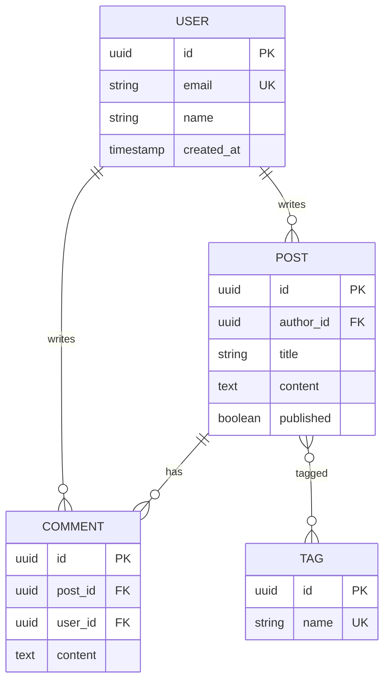

# Schema Examples & Templates

## Entity Relationship Design Template

```markdown
## Entity: [EntityName]

**Purpose:** [What this entity represents]
**Owner:** [Which domain/service owns this]

### Attributes

| Column | Type | Constraints | Description |
|--------|------|-------------|-------------|
| id | UUID/BIGINT | PK | Primary identifier |
| created_at | TIMESTAMP | NOT NULL, DEFAULT NOW() | Creation time |
| updated_at | TIMESTAMP | NOT NULL | Last modification |
| [column] | [type] | [constraints] | [description] |

### Relationships

| Related Entity | Cardinality | FK Column | On Delete |
|----------------|-------------|-----------|-----------|
| [Entity] | 1:N / N:1 / N:M | [fk_column] | CASCADE/SET NULL/RESTRICT |

### Indexes

| Name | Columns | Type | Purpose |
|------|---------|------|---------|
| idx_[table]_[column] | [columns] | BTREE/GIN/etc | [Query pattern supported] |
```

## Common Patterns

| Pattern | Use Case | Structure |
|---------|----------|-----------|
| **Soft Delete** | Recoverable deletion | `deleted_at TIMESTAMP NULL` |
| **Audit Trail** | Change history | Separate `_history` table |
| **Polymorphic** | Multiple parent types | `[type]_type` + `[type]_id` |
| **Self-Reference** | Hierarchical data | `parent_id` FK to same table |
| **Junction Table** | N:M relationships | Two FKs as composite PK |
| **JSON Column** | Flexible attributes | `metadata JSONB` |

---

## Migration Templates

### Create Table

```sql
-- Migration: create_[table_name]
-- Created: YYYY-MM-DD

-- Up
CREATE TABLE [table_name] (
    id UUID PRIMARY KEY DEFAULT gen_random_uuid(),
    [columns...]
    created_at TIMESTAMP NOT NULL DEFAULT NOW(),
    updated_at TIMESTAMP NOT NULL DEFAULT NOW()
);

CREATE INDEX idx_[table]_[column] ON [table_name]([column]);

-- Down
DROP TABLE IF EXISTS [table_name];
```

### Add Column

```sql
-- Migration: add_[column]_to_[table]
-- Created: YYYY-MM-DD

-- Up
ALTER TABLE [table_name]
ADD COLUMN [column_name] [TYPE] [CONSTRAINTS];

-- Down
ALTER TABLE [table_name]
DROP COLUMN IF EXISTS [column_name];
```

### Add Foreign Key

```sql
-- Migration: add_[fk_name]_fk
-- Created: YYYY-MM-DD

-- Up
ALTER TABLE [child_table]
ADD CONSTRAINT fk_[child]_[parent]
FOREIGN KEY ([column]) REFERENCES [parent_table]([column])
ON DELETE [CASCADE|SET NULL|RESTRICT];

-- Down
ALTER TABLE [child_table]
DROP CONSTRAINT IF EXISTS fk_[child]_[parent];
```

### Safe Column Rename (Zero Downtime)

```sql
-- Phase 1: Add new column
ALTER TABLE [table] ADD COLUMN [new_name] [TYPE];
UPDATE [table] SET [new_name] = [old_name];

-- Phase 2: Application uses both columns (deploy)

-- Phase 3: Drop old column (after verification)
ALTER TABLE [table] DROP COLUMN [old_name];
```

---

## Composite Index Rules

```markdown
## Composite Index: idx_[table]_[col1]_[col2]

**Columns:** (col1, col2, col3)

**Effective for:**
- WHERE col1 = ? ✅
- WHERE col1 = ? AND col2 = ? ✅
- WHERE col1 = ? AND col2 = ? AND col3 = ? ✅
- ORDER BY col1, col2 ✅

**NOT effective for:**
- WHERE col2 = ? ❌ (leading column missing)
- WHERE col3 = ? ❌
- ORDER BY col2, col1 ❌ (wrong order)
```

---

## Database-Specific Examples

### PostgreSQL: JSONB + GIN Index

```sql
CREATE TABLE products (
  id UUID PRIMARY KEY DEFAULT gen_random_uuid(),
  name VARCHAR(255) NOT NULL,
  attributes JSONB DEFAULT '{}',
  tags TEXT[] DEFAULT '{}'
);

CREATE INDEX idx_products_attributes ON products USING GIN (attributes);
CREATE INDEX idx_products_tags ON products USING GIN (tags);

-- Partial Index: active records only
CREATE INDEX idx_products_active ON products (name) WHERE deleted_at IS NULL;
```

### MySQL: JSON + Virtual Column Index

```sql
CREATE TABLE products (
  id CHAR(36) PRIMARY KEY,
  name VARCHAR(255) NOT NULL,
  attributes JSON,
  category VARCHAR(100) AS (JSON_UNQUOTE(attributes->'$.category')) STORED,
  INDEX idx_category (category)
);
```

---

## Migration Rollback Examples

### Expand-Contract Pattern

```
Phase 1 (Expand): Add new column, write to both
  ├─ Add new column (allow NULL)
  ├─ Update application (write to both old and new)
  └─ Deploy

Phase 2 (Migrate): Migrate existing data
  ├─ Batch copy existing data to new column
  ├─ Add NOT NULL constraint to new column
  └─ Update application (read from new only)

Phase 3 (Contract): Remove old column
  ├─ Remove old column references from application
  ├─ Drop old column
  └─ Deploy
```

### Safe Migration Example

```sql
-- Migration: Add email_verified column safely
-- Phase 1: Expand
ALTER TABLE users ADD COLUMN email_verified BOOLEAN DEFAULT false;

-- Phase 2: Migrate (run as batch job)
UPDATE users SET email_verified = true WHERE confirmed_at IS NOT NULL;

-- Phase 3: Contract (separate migration after app updated)
ALTER TABLE users DROP COLUMN confirmed_at;
```

### Rollback Migration (TypeScript)

```typescript
// Prisma migration with rollback
export async function up(prisma: PrismaClient) {
  await prisma.$executeRaw`ALTER TABLE users ADD COLUMN email_verified BOOLEAN DEFAULT false`;
}

export async function down(prisma: PrismaClient) {
  await prisma.$executeRaw`ALTER TABLE users DROP COLUMN email_verified`;
}
```

---

## Framework-Specific Patterns

### Prisma Schema

```prisma
model User {
  id        String   @id @default(uuid())
  email     String   @unique
  name      String?
  posts     Post[]
  createdAt DateTime @default(now())
  updatedAt DateTime @updatedAt

  @@index([email])
  @@map("users")
}

model Post {
  id        String   @id @default(uuid())
  title     String
  content   String?
  published Boolean  @default(false)
  author    User     @relation(fields: [authorId], references: [id])
  authorId  String

  @@index([authorId])
  @@map("posts")
}
```

### TypeORM Entity

```typescript
@Entity('users')
export class User {
  @PrimaryGeneratedColumn('uuid')
  id: string;

  @Column({ unique: true })
  @Index()
  email: string;

  @Column({ nullable: true })
  name: string;

  @OneToMany(() => Post, (post) => post.author)
  posts: Post[];

  @CreateDateColumn()
  createdAt: Date;

  @UpdateDateColumn()
  updatedAt: Date;
}
```

### Drizzle Schema

```typescript
import { pgTable, uuid, varchar, timestamp, index } from 'drizzle-orm/pg-core';

export const users = pgTable('users', {
  id: uuid('id').primaryKey().defaultRandom(),
  email: varchar('email', { length: 255 }).notNull().unique(),
  name: varchar('name', { length: 255 }),
  createdAt: timestamp('created_at').defaultNow().notNull(),
  updatedAt: timestamp('updated_at').defaultNow().notNull(),
}, (table) => ({
  emailIdx: index('idx_users_email').on(table.email),
}));
```

---

## ER Diagram (Mermaid)



---

## Code Standards

### Good Schema Output

```sql
-- Migration: create_orders
-- Purpose: Store customer orders with line items
-- Related: users, products tables

CREATE TABLE orders (
    id UUID PRIMARY KEY DEFAULT gen_random_uuid(),
    user_id UUID NOT NULL REFERENCES users(id) ON DELETE RESTRICT,
    status VARCHAR(20) NOT NULL DEFAULT 'pending'
        CHECK (status IN ('pending', 'confirmed', 'shipped', 'delivered', 'cancelled')),
    total_amount DECIMAL(10, 2) NOT NULL,
    created_at TIMESTAMP NOT NULL DEFAULT NOW(),
    updated_at TIMESTAMP NOT NULL DEFAULT NOW()
);

CREATE INDEX idx_orders_user_id ON orders(user_id);
CREATE INDEX idx_orders_status ON orders(status) WHERE status != 'cancelled';

COMMENT ON TABLE orders IS 'Customer orders';
COMMENT ON COLUMN orders.status IS 'Order lifecycle status';
```

### Bad Schema Output

```sql
CREATE TABLE orders (
    id INT,
    user INT,
    status TEXT,
    amount FLOAT
);
```

**Key differences:** PK/FK constraints · type precision · CHECK constraints · indexes · comments · naming conventions
