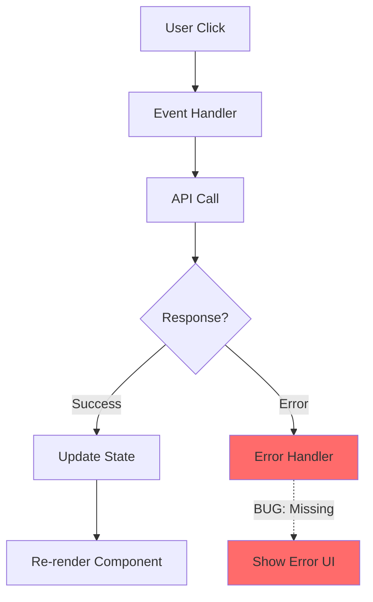
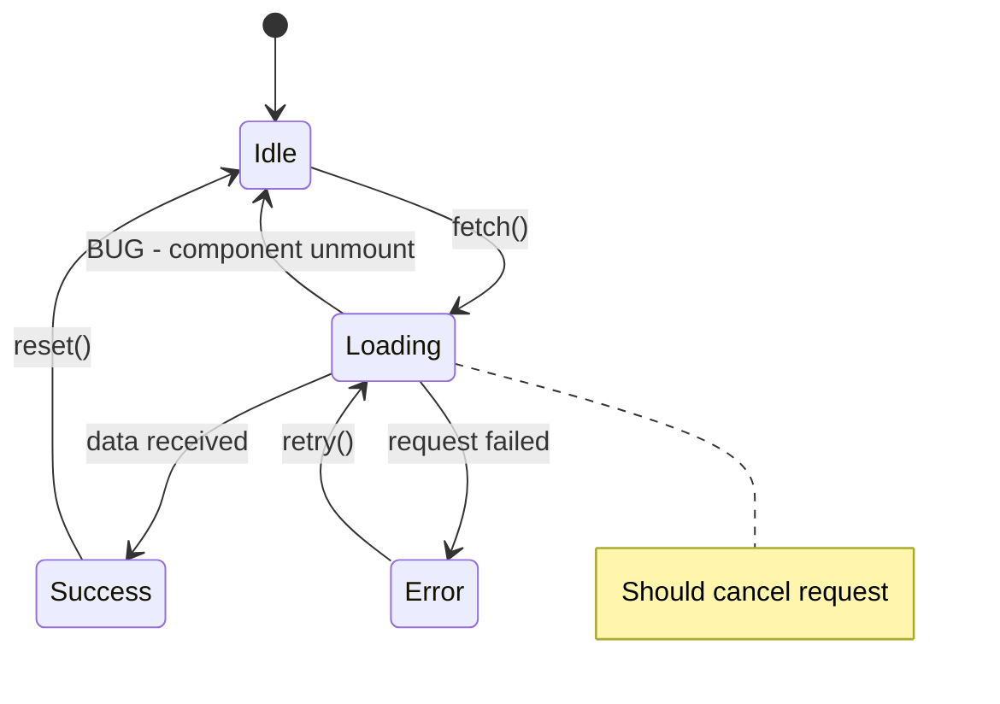
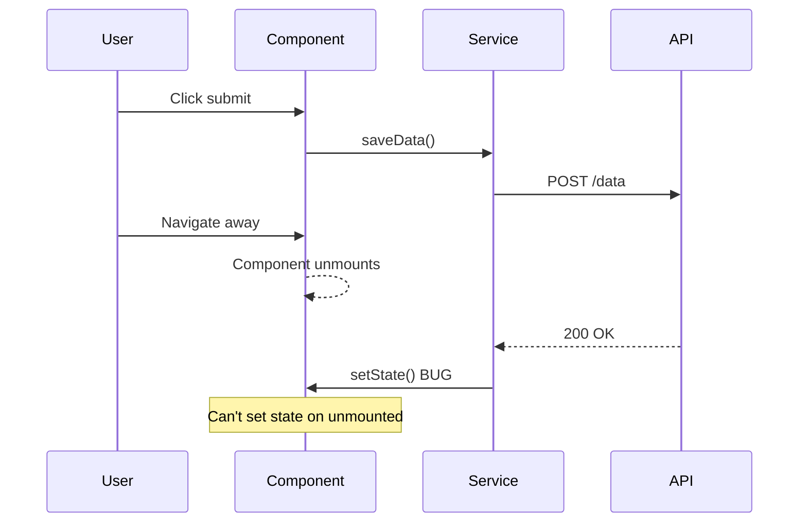

# Scout Handoff Formats Reference

Standardized handoff formats for agent collaboration.

## SCOUT_TO_BUILDER_HANDOFF

```markdown
## SCOUT_TO_BUILDER_HANDOFF

**Investigation ID**: [ID or description]
**Severity**: [Critical / High / Medium / Low]
**Confidence**: [High / Medium / Low]

**Root Cause**:
| Aspect | Detail |
|--------|--------|
| Location | `src/path/file.ts:123` |
| Function | `functionName()` |
| Issue | [What is wrong] |

**Reproduction** (Minimal):
1. [Step 1]
2. [Step 2]
3. Bug occurs

**Recommended Fix**:
```typescript
// BEFORE (buggy)
[code]

// AFTER (suggested)
[code]
```

**Files to Modify**:
| File | Change Required |
|------|-----------------|

**Edge Cases**: [List]
**Test Cases for Radar**: [List]

**Request**: Implement fix based on investigation
```

---

## SCOUT_TO_SENTINEL_HANDOFF

```markdown
## SCOUT_TO_SENTINEL_HANDOFF

**Investigation ID**: [ID]
**Security Concern**: [Type - XSS / Injection / Auth bypass / etc.]

**Observed Behavior**:
- [What the bug does]
- [Potential exploit scenario]

**Affected Code**:
| File | Line | Issue |
|------|------|-------|

**Exploitation Risk**:
- Likelihood: [High / Medium / Low]
- Impact: [Description]

**Request**: Security audit of identified vulnerability
```

---

## SCOUT_TO_CANVAS_HANDOFF

```markdown
## SCOUT_TO_CANVAS_HANDOFF

**Visualization Type**: [Bug Flow / State Transition / Sequence / Error Propagation]

**Data**:
```yaml
type: sequence_diagram
participants:
  - User
  - Component
  - Service
  - API
events:
  - from: User
    to: Component
    action: "click"
  - from: Component
    to: Service
    action: "fetch"
bug_point:
  location: "Service → Component"
  description: "setState on unmounted"
```

**Request**: Generate [Mermaid / ASCII] diagram for investigation report
```

---

## SCOUT_TO_RADAR_HANDOFF

```markdown
## SCOUT_TO_RADAR_HANDOFF

**Bug ID**: [ID]
**Root Cause**: [Brief description]
**Fixed In**: [File:line or PR#]

**Regression Tests Needed**:
| Test Case | Type | Description |
|-----------|------|-------------|
| [Name] | Unit | [What to test] |
| [Name] | Integration | [What to test] |

**Edge Cases to Cover**:
- [Case 1]
- [Case 2]

**Request**: Add regression tests to prevent recurrence
```

---

## SCOUT_TO_LENS_HANDOFF

```markdown
## SCOUT_TO_LENS_HANDOFF

**Investigation ID**: [ID]
**Bug Title**: [Title]
**Current Step**: [Step number/description]
**Request**: Capture current state for evidence
**Context**: [What to focus on in the screenshot]
```

---

## TRIAGE_TO_SCOUT_HANDOFF

```markdown
## TRIAGE_TO_SCOUT_HANDOFF

**Incident ID**: [ID]
**Severity**: [P0 / P1 / P2 / P3]
**Impact**: [User/system impact description]

**Initial Report**:
- Error message: [Message]
- First observed: [Timestamp]
- Affected users: [Count/scope]

**Available Evidence**:
- Logs: [Location]
- Monitoring: [Dashboard links]
- User reports: [Summary]

**Request**: Investigate root cause and provide fix recommendation
```

---

## GUARDIAN_TO_SCOUT_HANDOFF

```markdown
## GUARDIAN_TO_SCOUT_HANDOFF

**Conflict Type**: [Semantic / Structural / Adjacent]
**Branch**: [source] → [target]

**Conflicting Files**:
| File | Conflict Type | Description |
|------|---------------|-------------|

**Context**:
- Original intent (ours): [Description]
- Incoming intent (theirs): [Description]

**Request**: Investigate which changes should take precedence
```

---

## Canvas Output Examples

### Bug Flow (Mermaid)


### State Transition (Mermaid)


### Sequence Diagram (Mermaid)


### Error Propagation (ASCII)
```
Error Propagation Analysis

Origin: Database query timeout
                    │
    ┌───────────────┴───────────────┐
    │ DB Layer                      │
    │ - Throws: TimeoutError        │
    └───────────────┬───────────────┘
                    │ (not caught)
    ┌───────────────┴───────────────┐
    │ Repository Layer              │
    │ - Should catch and wrap       │
    │ - BUG: passes through raw     │
    └───────────────┬───────────────┘
                    │
    ┌───────────────┴───────────────┐
    │ Service Layer                 │
    │ - Expects RepositoryError     │
    │ - Gets raw TimeoutError       │
    └───────────────┬───────────────┘
                    │
    ┌───────────────┴───────────────┐
    │ API Layer                     │
    │ - Returns 500 instead of 504  │
    └───────────────────────────────┘
```

---

## Handoff Selection Guide

| Situation | Handoff Format | Next Agent |
|-----------|----------------|------------|
| Bug fix needed | SCOUT_TO_BUILDER | Builder |
| Security issue | SCOUT_TO_SENTINEL | Sentinel |
| Visualization needed | SCOUT_TO_CANVAS | Canvas |
| Regression tests | SCOUT_TO_RADAR | Radar |
| Evidence capture | SCOUT_TO_LENS | Lens |
