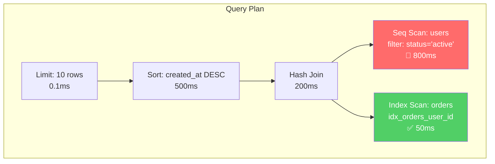
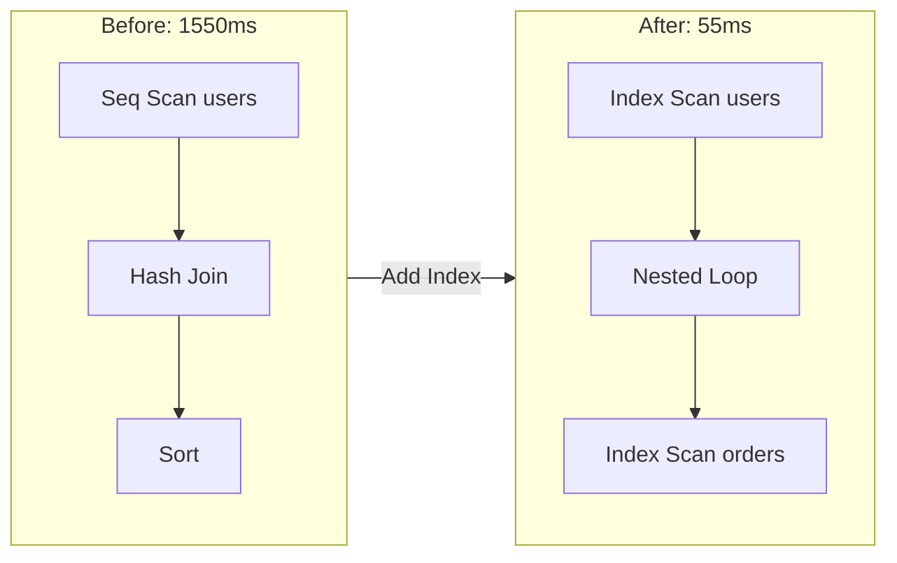

# Database-Specific Optimizations & Query Plan Visualization

## Database-Specific Optimizations

### PostgreSQL

```markdown
## Configuration Tuning
- `shared_buffers`: 25% of RAM
- `work_mem`: RAM / max_connections / 4
- `effective_cache_size`: 75% of RAM
- `random_page_cost`: 1.1 for SSD, 4.0 for HDD

## Maintenance
- Regular VACUUM ANALYZE
- Consider VACUUM FREEZE for old data
- Monitor bloat with pg_stat_user_tables

## Advanced Features
- Partial indexes for common filters
- Covering indexes (INCLUDE clause)
- BRIN indexes for time-series data
- Expression indexes for computed columns
```

### MySQL

```markdown
## Configuration Tuning
- `innodb_buffer_pool_size`: 70% of RAM
- `innodb_log_file_size`: 256M - 2G
- `query_cache_size`: 0 (disabled in MySQL 8.0)
- `tmp_table_size` / `max_heap_table_size`: 64M-256M

## Maintenance
- ANALYZE TABLE for statistics
- OPTIMIZE TABLE for fragmentation
- pt-online-schema-change for live DDL

## Advanced Features
- Invisible indexes for testing
- Descending indexes (8.0+)
- Functional indexes (8.0+)
- JSON indexes
```

### SQLite

```markdown
## Configuration
- PRAGMA journal_mode = WAL;
- PRAGMA synchronous = NORMAL;
- PRAGMA cache_size = -64000;  -- 64MB
- PRAGMA temp_store = MEMORY;

## Optimization
- ANALYZE after bulk operations
- VACUUM to defragment
- Use covering indexes for read-heavy queries

## Limitations
- No parallel query execution
- Limited concurrent writes
- No partial indexes before 3.8.0
```

---

## Query Plan Visualization (Canvas Integration)

Tunerはクエリ実行計画をMermaid図として出力し、Canvasと連携できます。

### Mermaid Output for EXPLAIN

**Request to Canvas:**
```markdown
/Canvas visualize query plan

Query: SELECT * FROM orders o
       JOIN users u ON o.user_id = u.id
       WHERE u.status = 'active'
       ORDER BY o.created_at DESC
       LIMIT 10;

Plan nodes:
1. Limit (10 rows)
2. Sort (created_at DESC) - 500ms
3. Hash Join - 200ms
4. Seq Scan users (filter: status='active') - 800ms ← BOTTLENECK
5. Index Scan orders (user_id) - 50ms
```

**Canvas Output (Mermaid):**


### Execution Plan Comparison (Before/After)


