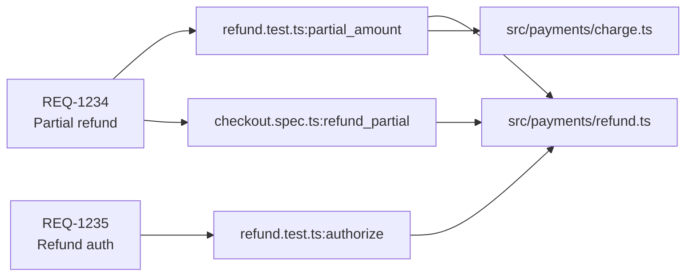

# Traceability Matrix

**Purpose:** Build requirement ↔ test case ↔ source code ↔ result matrices.
**Read when:** You are running the `trace` Recipe.

## Contents
- Why Traceability Matters
- ID Source Discovery
- Linking Strategy
- Matrix Layout
- Coverage Verdicts
- Anti-Patterns
- Output Annotations

---

## Why Traceability Matters

Traceability matrix answers four questions at once:
1. Which requirements are tested? (and which aren't)
2. Which tests cover each requirement? (single-test fragility check)
3. What code does each test exercise?
4. What is the latest result for each requirement?

This is the canonical evidence pack for compliance audits (ISO 26262, IEC 62304, SOC 2 CC7.2), regulated releases, and acceptance reviews.

---

## ID Source Discovery

Vista will not invent requirement IDs. Confirm the source at INGEST.

### Accepted ID sources (priority order)

1. **Test annotations** (most reliable)
   - JUnit `@Tag("REQ-1234")` or `@DisplayName("REQ-1234: ...")`
   - pytest markers: `@pytest.mark.req("REQ-1234")`
   - Jest/Vitest: test description prefix `it("REQ-1234: ...")`
   - Allure labels: `feature`, `story`, `epic`
   - Playwright tags: `test("@req-1234 …")`
2. **Gherkin / Cucumber feature files**
   - `Feature:` / `Scenario:` lines, with `@REQ-1234` tags
3. **Markdown spec files with frontmatter**
   - `id: REQ-1234` in frontmatter; tests reference via comment or annotation
4. **External traceability source**
   - User-provided JSON/YAML mapping file (`docs/traceability.yaml`)
   - Jira/Linear export

If none of the above produce IDs, **refuse to generate the matrix** and report what's missing.

### Discovery commands

```bash
# Annotations
grep -rE "(@Tag|@pytest.mark.req|@req|REQ-[0-9]+)" tests/ src/

# Allure labels
grep -rE "feature|story|epic" allure-results/

# Playwright tags
grep -rE 'test\("@\w+' e2e/

# Gherkin tags
grep -rE "^\s*@\w+" features/
```

---

## Linking Strategy

Build three relations:

### 1. Requirement ↔ Test

```yaml
REQ-1234:
  description: "User can refund partial payments"
  tests:
    - id: "payments.refund#partial_amount"
      type: unit
      file: tests/payments/refund.test.ts
      annotation_source: "@req"
    - id: "e2e/checkout.spec.ts#refund_partial"
      type: e2e
      file: e2e/checkout.spec.ts
      annotation_source: "playwright tag @req-1234"
```

### 2. Test ↔ Source File

Derived from coverage data (`coverage-final.json`, `lcov.info`):

```yaml
"payments.refund#partial_amount":
  covered_files:
    - path: src/payments/refund.ts
      lines_touched: [12, 15, 18-22, 27]
    - path: src/payments/charge.ts
      lines_touched: [88, 92]
```

When per-test coverage isn't available (most lcov outputs are aggregate), Vista downgrades to **suite-level** mapping and notes the limitation.

### 3. Requirement ↔ Result

Aggregate from latest run:

```yaml
REQ-1234:
  latest_result: passed
  last_run: <timestamp>
  pass_rate_30d: 0.94
  flake_rate_30d: 0.04
  unique_test_count: 2
```

---

## Matrix Layout

### Markdown table (default)

```
| Req ID | Description                | Tests | Type Mix | Last | Pass% (30d) | Coverage |
|--------|----------------------------|-------|----------|------|-------------|----------|
| REQ-1234 | Partial refund           | 2     | unit + e2e | ✅ | 94% | refund.ts (78%) |
| REQ-1235 | Refund authorization     | 1     | unit only  | ✅ | 100% | refund.ts (78%) ⚠ |
| REQ-1236 | Refund email notification | **0** | —          | —  | — | — 🚨 UNCOVERED |
| REQ-1237 | Idempotency on retry      | 3     | unit + integ + e2e | ❌ | 60% 🚨 | retry.ts (45%) ⚠ |
```

### Verdicts column legend

| Verdict | Meaning |
|---------|---------|
| 🚨 UNCOVERED | Zero tests for this requirement |
| ⚠ FRAGILE | Only 1 test for this requirement |
| ⚠ UNIT-ONLY | Only unit tests; no integration/e2e for safety-critical req |
| ⚠ LOW-PASS | Pass rate < 80% over window |
| ⚠ FLAKY | Flake rate ≥ 5% |
| ✅ COVERED | ≥2 tests, mixed types, pass ≥80%, flake <5% |

### Mermaid relationship graph (optional supplement)



Limit graph to top-30 requirements; otherwise fall back to table-only.

---

## Coverage Verdicts

Apply these rules in order; first match wins.

```yaml
RULES:
  - if: tests == 0
    verdict: UNCOVERED 🚨
  - if: tests == 1
    verdict: FRAGILE ⚠
  - if: criticality == "high" AND test_types == ["unit"]
    verdict: UNIT-ONLY ⚠
  - if: pass_rate_30d < 0.80
    verdict: LOW-PASS ⚠
  - if: flake_rate_30d >= 0.05
    verdict: FLAKY ⚠
  - else:
    verdict: COVERED ✅
```

Multiple verdicts can apply (e.g., FRAGILE + FLAKY); list all.

---

## Anti-Patterns

| ID | Signal | Diagnosis |
|----|--------|-----------|
| `ORPHAN-TEST` | Test exists but no req annotation | Test untraceable; recommend annotation |
| `ORPHAN-REQ` | Req exists but no test | UNCOVERED; recommend Radar/Voyager |
| `OVERTESTED-REQ` | One req has ≥10 distinct tests | Possible duplication; recommend Zen review |
| `LATE-LINK` | Test exists for >30 days before req annotation added | Process gap; recommend annotation discipline |
| `STALE-REQ` | Req last touched >365 days ago, no tests | Likely deprecated; recommend Void review |

---

## Output Annotations

```yaml
Source:
  artifacts:
    - "tests/ + src/ (annotation grep)"
    - "coverage/coverage-final.json (jest-coverage-1.x)"
    - "junit.xml (junit-xml-v5)"
  id_source: "junit @Tag annotations + playwright tags"
  time_window: "latest run (commit <sha>) for outcomes; 30 days for pass/flake rates"
Sample_Size:
  requirements_total: 184
  requirements_with_tests: 142
  requirements_uncovered: 42
  tests_with_req_link: 487
  tests_orphan: 73
Verdicts_Summary:
  COVERED: 128
  FRAGILE: 14
  UNIT-ONLY: 6
  LOW-PASS: 3
  FLAKY: 4
  UNCOVERED: 42
Findings:
  - id: ORPHAN-REQ
    summary: "42 requirements have zero tests; 18 of those are tagged criticality=high"
    recommendation: "Hand off to Radar/Voyager for prioritized test addition (top 10 by criticality)"
Limitations:
  - "Per-test coverage unavailable (lcov is aggregate); test ↔ source links are at suite level only"
```
