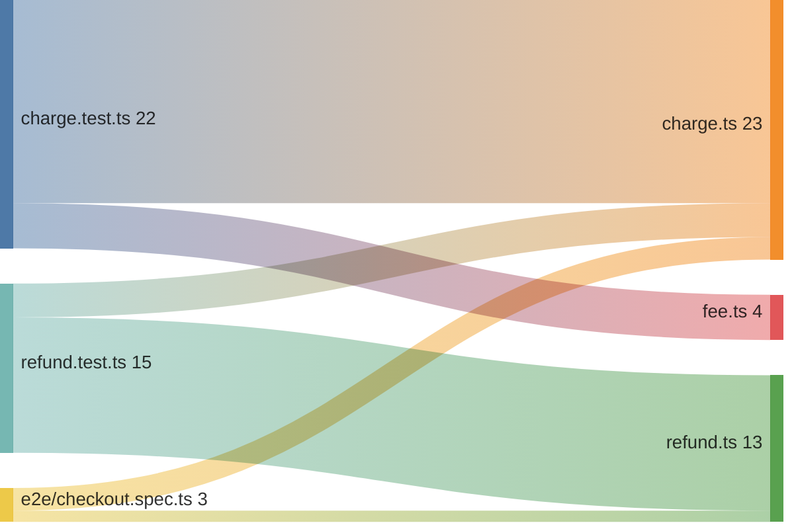
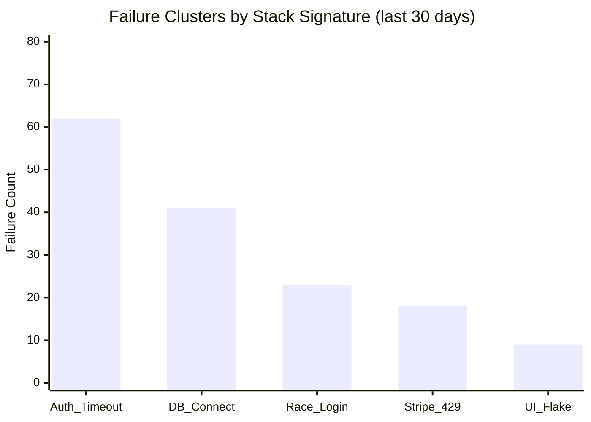
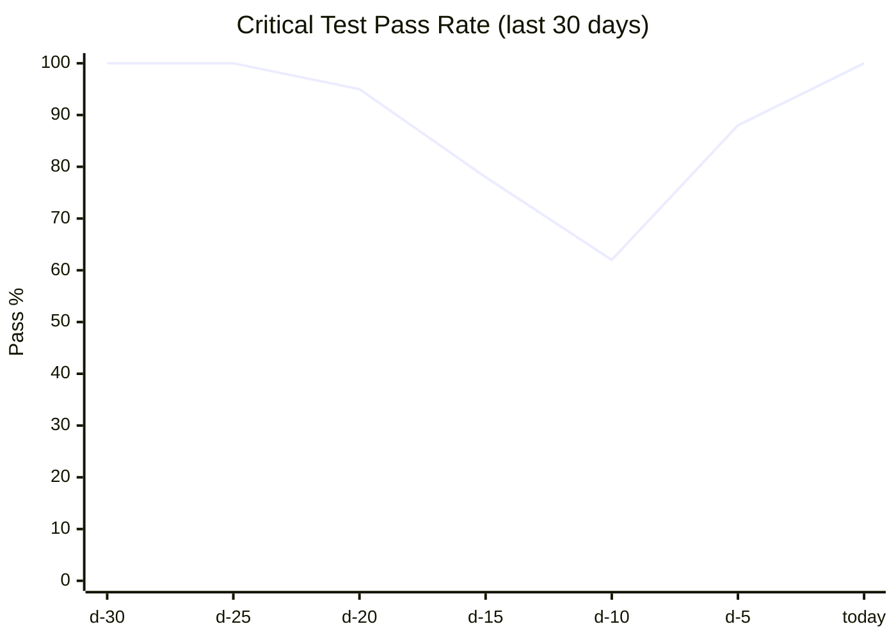
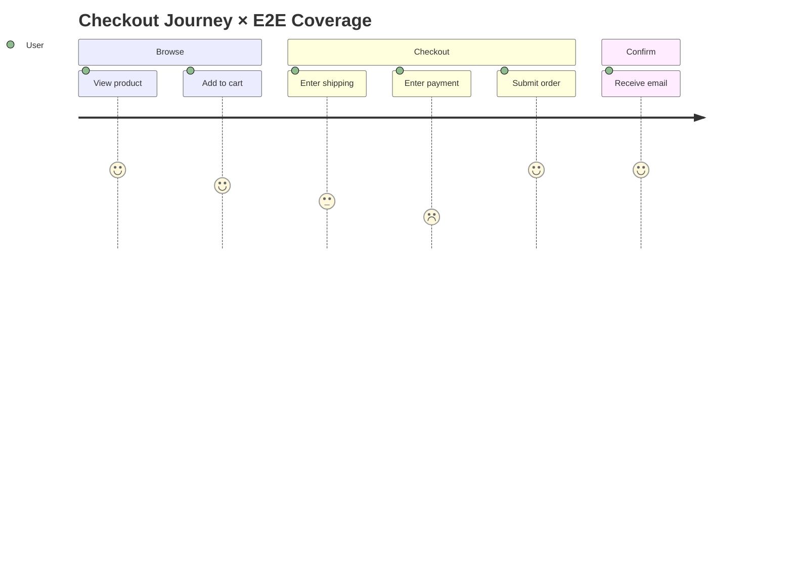
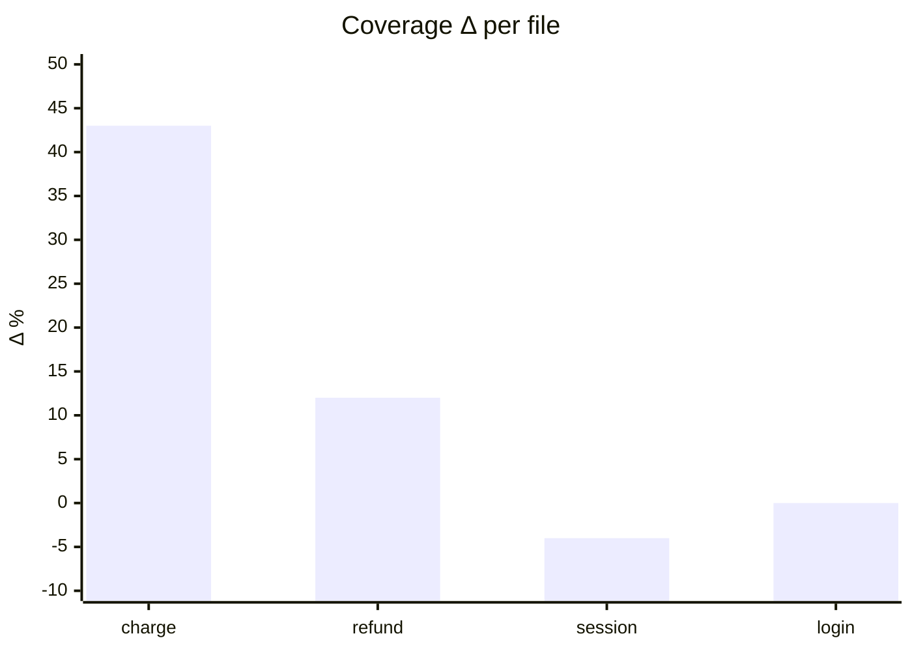

# Visualization Patterns

**Purpose:** Recipe-to-diagram-pattern map for the RENDER phase.
**Read when:** You are choosing how to visualize parsed test data.

## Contents
- Format Selection Matrix
- Coverage Treemap
- Coverage Sunburst
- Result Heatmap (Suite × Run)
- Test Pyramid
- Sankey: Test → Code Coverage Flow
- Failure Cluster Bar Chart
- Regression Timeline (XY Chart)
- Journey Map with E2E Overlay
- PR Coverage Diff
- Accessibility Defaults
- Anti-Patterns to Avoid in Visualization

---

## Format Selection Matrix

| Recipe / Goal | Default Format | Use D2 if | Use ASCII if | Use draw.io if |
|---------------|----------------|-----------|---------------|------------------|
| Coverage map (file tree) | Mermaid treemap | files >100 | terminal/comment | presentation slide |
| Coverage breakdown by package | Mermaid sunburst | depth >5 | always supported | presentation |
| Result heatmap | Mermaid xy/heatmap or D2 grid | suites >50 | terminal | presentation |
| Test pyramid | ASCII pyramid + Mermaid pie | never | always primary | presentation |
| Test → Code flow | Mermaid sankey | nodes >50 | rarely useful | presentation |
| Failure clusters | Mermaid bar (xychart) | clusters >30 | terminal | presentation |
| Regression timeline | Mermaid xychart-beta | runs >100 | rarely useful | presentation |
| Journey map | Mermaid journey + flowchart overlay | rare | rarely useful | presentation |
| Traceability matrix | Markdown table | rare | always works | presentation |

Always prefer Mermaid + ASCII fallback. Switch to D2 only when Mermaid layout collapses.

---

## Coverage Treemap

Use when files >100 and you want hot/cold visual triage.

### Mermaid (treemap, Mermaid v10+)

```
flowchart TB
  subgraph src["src/ (line: 78%, branch: 64%)"]
    direction TB
    subgraph payments["payments/ (line: 42% ⚠)"]
      pay1["charge.ts (28%)"]:::cold
      pay2["refund.ts (55%)"]:::warm
    end
    subgraph auth["auth/ (line: 91% ✓)"]
      a1["login.ts (95%)"]:::hot
      a2["session.ts (88%)"]:::hot
    end
  end
  classDef cold fill:#d73027,color:#fff
  classDef warm fill:#fdae61,color:#000
  classDef hot fill:#1a9850,color:#fff
```

### Color encoding

| Coverage | Class | Hex | Label suffix |
|----------|-------|-----|--------------|
| <50% line | cold | `#d73027` | ⚠ |
| 50-80% line | warm | `#fdae61` | (none) |
| ≥80% line | hot | `#1a9850` | ✓ |

Always pair color with a label suffix and an icon. Color alone fails accessibility.

---

## Coverage Sunburst

Use when files ≤100 and hierarchy depth ≤5. Sunburst is more legible for nested package structures.

Mermaid does not natively support sunburst. Render as a nested pie + table, or switch to D2:

### D2 sunburst-equivalent

```
src: {
  shape: hierarchy
  payments.shape: hierarchy
  payments.charge: "28%" {style.fill: "#d73027"}
  payments.refund: "55%" {style.fill: "#fdae61"}
  auth.shape: hierarchy
  auth.login: "95%" {style.fill: "#1a9850"}
  auth.session: "88%" {style.fill: "#1a9850"}
}
```

### Fallback ASCII radial

```
src/ ────┬── payments/ ──┬── charge.ts   28% ⚠
         │               └── refund.ts   55%
         └── auth/ ──────┬── login.ts    95% ✓
                         └── session.ts  88% ✓
```

---

## Result Heatmap (Suite × Run)

Show pass/fail across recent runs.

### Mermaid (xychart-beta with discrete color cells)

Mermaid lacks a native heatmap. Use a stacked bar or fall back to a markdown grid:

```
| Suite \\ Run     | #142 | #143 | #144 | #145 | #146 |
|------------------|------|------|------|------|------|
| auth.login       | ✅   | ✅   | ✅   | ✅   | ✅   |
| payments.charge  | ✅   | ❌   | 🔁   | ❌   | ✅   |
| cart.discount    | ✅   | ✅   | ✅   | ⏭   | ✅   |
```

Legend: `✅ pass`, `❌ fail`, `🔁 flake (passed on retry)`, `⏭ skipped`, `🚫 errored`.

### When to switch to D2

`suites × runs > 500` cells — Markdown table becomes unreadable. Switch to D2 grid layout with color cells.

---

## Test Pyramid

Standard distribution: Unit > Integration > E2E.

### ASCII

```
          ╱E2E╲      45 tests  (8%)
         ╱─────╲
        ╱ Integ ╲    120 tests (22%)
       ╱─────────╲
      ╱   Unit    ╲  385 tests (70%)
     ╱─────────────╲
```

### Mermaid pie

```
pie title Test Pyramid (550 total)
    "Unit" : 385
    "Integration" : 120
    "E2E" : 45
```

### Anti-pattern detection

| Pattern | Signal | Diagnosis |
|---------|--------|-----------|
| `ICE-CREAM-CONE` | E2E > Integration > Unit | Too E2E-heavy; slow CI, brittle |
| `HOURGLASS` | Many Unit + many E2E, few Integration | Missing integration layer; gaps in seam testing |
| `INVERTED` | E2E > Unit | Severe; recommend Radar to add unit tests |
| `MONOLITHIC` | One layer >95% of tests | Layer specialization missing |

Always cite the pattern by ID in `Findings`.

---

## Sankey: Test → Code Coverage Flow

Show how test files cover source files.



The width = number of tests touching the source file. Reveals over-tested and under-tested files at a glance.

Limit to top-50 nodes. Above that, group by package.

---

## Failure Cluster Bar Chart



Cluster definition: same `failure.type` and first 3 stack frames (after symbolication). Cluster threshold ≥3 occurrences.

---

## Regression Timeline (XY Chart)



Annotate dips with commit SHA and a referenced PR number in the `Findings` block.

---

## Journey Map with E2E Overlay



Vista appends an overlay table:

| Step | E2E Test | Last Result | Flake Rate |
|------|----------|-------------|------------|
| View product | `e2e/browse.spec.ts:viewProduct` | ✅ pass | 0% |
| Add to cart | `e2e/cart.spec.ts:addToCart` | ✅ pass | 2% |
| Enter shipping | *(no test)* | ⚠ uncovered | — |
| Enter payment | `e2e/checkout.spec.ts:payment` | ❌ fail (run #146) | 8% 🚨 |
| Submit order | `e2e/checkout.spec.ts:submit` | ✅ pass | 0% |

---

## PR Coverage Diff

Two-panel layout: before / after.

### Markdown summary table (always include)

```
| Path                 | Before | After | Δ      | Lines Δ |
|----------------------|--------|-------|--------|---------|
| src/payments/charge  | 28%    | 71%   | +43% ✅ | +12     |
| src/auth/session     | 88%    | 84%   | -4% ⚠  | -2      |
| **TOTAL**            | 78%    | 80%   | +2% ✅  | +18     |
```

### Mermaid bar (delta-only)



---

## Accessibility Defaults

- **Palette:** Okabe-Ito (color-blind safe) or ColorBrewer Set2.
  - Pass: `#1a9850` (green) + ✓ icon
  - Warn: `#fdae61` (orange) + (no icon)
  - Fail: `#d73027` (red) + ⚠ icon
  - Skip: `#999999` (grey) + ⏭ icon
  - Flake: `#7570b3` (purple) + 🔁 icon
- **Contrast:** ≥4.5:1 for text on color (WCAG 2.2 AA).
- **Redundant encoding:** Always pair color with shape, icon, or label suffix.
- **Alt-text:** Every diagram block includes a 1-2 sentence alt-text describing the headline finding.
- **ASCII fallback:** Provide ASCII alongside Mermaid when the audience may consume in plain text (Slack DM, terminal, code comment).

---

## Anti-Patterns to Avoid in Visualization

| Anti-Pattern | Symptom | Fix |
|--------------|---------|-----|
| Color-only encoding | Pass/fail distinguished only by green/red | Add ✅/❌ icons |
| Misleading scale | Coverage axis 70-100% (zoomed) | Use 0-100% or annotate |
| Combining branch + line | One number "85% covered" | Always split branch and line |
| Sample-size omission | "5% flake rate" with no n | Always cite n=runs and time window |
| Anonymous tests | "Test #42 failed" instead of test name | Use full classname#method |
| Cherry-picked window | Showing only the green week | Default 30-day window; require user override to shrink |
| Flake hidden in pass count | Counting retried-pass as plain pass | Mark as 🔁 flake explicitly |
